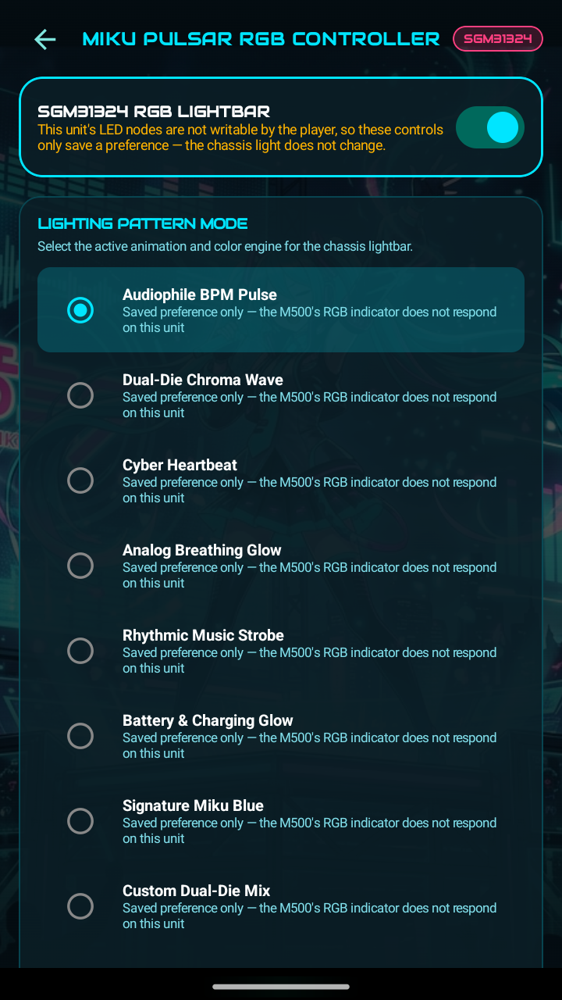

<h1 align="center">MikuOS</h1>

<p align="center"><em>A platform-signed Android 14 replacement for the HiBy Digital M500 x Hatsune Miku. You own the keys, the DACs, and every number on the screen.</em></p>

<p align="center">
  
  
  
  
  
  
</p>

> **Work in progress, and help is wanted.** This is one person and one device. Issues and pull
> requests are welcome. The [What is verified](#what-is-verified) table below is the honest line
> between what has been confirmed on hardware and what has not, and the things that would help
> most are listed under [Contributing](#contributing).

MikuOS replaces the software on a HiBy Digital M500 x Hatsune Miku DAP. Home screen, system UI,
navigation, settings, hardware controls and [Miku Music](https://github.com/sworrl/MikuMusic) are
ours, re-signed with a platform key you generate yourself, so they run with platform permissions on
a device that is not rooted and does not need to be.

**Why it exists.** The M500 is a very good piece of audio hardware running software that gets in its
way. Playback goes through Android's mixer, so a 44.1kHz file is resampled before it reaches a pair
of DACs chosen specifically for not needing that. The launcher cannot be replaced properly. The
system UI shows readings it did not take. None of that is a hardware limit, all of it is fixable,
and the fix is to replace the software rather than patch around it.

**No root.** Every earlier attempt at this reached for Magisk. MikuOS does not. The apps are signed
with the same platform key as the framework they run beside, so they simply HAVE the permissions
instead of asking a root daemon for them. A `su` failure in this codebase is treated as a bug in the
code, not a reason to install a root daemon.

<p align="center">
  
  
  
</p>

---

## Contents

- [What is verified](#what-is-verified)
- [Installing](#installing)
- [What is in the OS](#what-is-in-the-os)
- [Miku Music](#miku-music)
- [The launcher](#the-launcher)
- [System UI](#system-ui)
- [Settings and hardware](#settings-and-hardware)
- [The bit-perfect audio path](#the-bit-perfect-audio-path)
- [The poor man's ambient light sensor](#the-poor-mans-ambient-light-sensor)
- [Making it fast](#making-it-fast)
- [Building an image](#building-an-image)
- [Flashing](#flashing)
- [Signing and keys](#signing-and-keys)
- [Hard-won platform facts](#hard-won-platform-facts)
- [Repo structure](#repo-structure)
- [The device](#the-device)
- [What we keep from HiBy and what we replace](#what-we-keep-from-hiby-and-what-we-replace)
- [Known limitations](#known-limitations)
- [Contributing](#contributing)
- [Legal](#legal)
- [Attributions](ATTRIBUTIONS.md)

---

## What is verified

The line between confirmed on real hardware and not. It is the first section on purpose.

Legend: ✅ confirmed on a real M500 · ⚠️ implemented, not proven · ❌ tried, does not work.

| Thing | State | How it was checked |
|---|---|---|
| Platform-signed apps, no root | ✅ | Running daily. `su` is never invoked anywhere in the shipped code |
| Re-keyed system image boots | ✅ | Known-good image `mikuos_super_rekey1_GOOD_20260827.img`, boot-verified |
| APEX re-signing to a custom key | ✅ | Proven on `com.android.mediaprovider`, compressed `.capex` included |
| Bit-perfect DIRECT output to the DACs | ✅ | 44.1 / 48 / 192kHz, 24-bit packed, confirmed with `dumpsys media.audio_flinger` |
| Gesture navigation replacing the stock nav bar | ✅ | An accessibility service IS the navigation on this device |
| Suppressing the stock nav pill | ✅ | `StatusBarManager` disable flags. `NavigationBar0` reports `isVisible=false` after a reboot |
| OS-wide idle dim on real system brightness | ✅ | Four-tier ladder writing `Settings.System.SCREEN_BRIGHTNESS` |
| Fn-key pocket lock without root | ✅ | HiBy's framework honors `Settings.Global button_lock` |
| Camera used as an ambient light sensor | ✅ | See below. The device has no ALS at all |
| Custom LED behavior | ✅ | `miku_led.rc` baked into vendor, needs a reflash to take |
| Last.fm scrobbling | ✅ | Browser token flow, per-user session key. App key lives in `local.properties`, never the repo |
| Wi-Fi positioning without Google location | ✅ | BeaconDB then Apple WPS, with travelling-AP exclusion |
| WireGuard client in the launcher | ⚠️ | Implemented, the VPS-relay path for CGNAT is the untested part |
| Bluetooth LDAC push | ⚠️ | Codec enforcement is implemented, unproven until an LDAC sink is on hand |
| Web installer (WebUSB fastboot) | ⚠️ | Hosted at `mikuos.falcontechnix.com` in bring-your-own-images mode. `EXPECTED_PRODUCTS` still unconfirmed |
| Full AOSP-from-source build | ⚠️ | Device tree and lunch combo exist, the sync is RAM-constrained and unfinished |
| Reading the DAC state back from kernel sysfs | ❌ | Current builds report `KERNEL SYSFS NOT READABLE BY THIS PROCESS` and honestly show a dash |
| GSI (generic system image) | ❌ | Vendor mandates six legacy HIDL services Android 14 dropped. Abandoned for a stock-QSSI base |
| FM tuner | ❌ | Has never worked on-device. SELinux keys `/dev/radio0` on the package name, not the signature |
| Kernel 5.15.209 | ❌ | A/B proven to break charging: `mp2731` never qualifies the input and the device drains on the cable. Stock 5.15.153 stays |

---

## Installing

There is no prebuilt image to download, and there will not be one. A MikuOS super image contains
HiBy Digital's system and vendor firmware, which is not ours to hand out. You build it from the
stock firmware you already have on your own device. See [Building an image](#building-an-image).

Once you have an image, there are two ways to put it on the device.

**From a browser.** `mikuos.falcontechnix.com` serves the WebUSB installer. It talks fastboot from
Chrome, takes the images you supply, splits super into 64MB chunks and resumes if the transfer
drops. It does not host any images. Treat it as a flashing tool, not a download.

**From a shell.** The scripts under `mikuos/build/` do the same job with more output when something
goes wrong, which is the reason to prefer them the first time.

```bash
# Keeps /data: likes, history, WiFi, installed apps
./mikuos/build/flash_mikuos_keepdata.sh

# Wipes /data
./mikuos/build/flash_mikuos_clean.sh
```

Read [Flashing](#flashing) before either one. The failure modes on this device are specific and a
couple of them look like a dead device when they are not.

---

## What is in the OS

| Component | Package | What it does |
|---|---|---|
| **Miku Music** | `com.miku.player` | The player. Bit-perfect, libprojectM, cassette deck. [Its own repo](https://github.com/sworrl/MikuMusic) |
| **Launcher** | `com.miku.launcher` | Home screen, app drawer, lockscreen, AOD, weather, GPS map, network and battery observatories, the ingest engine, the BPM game |
| **System UI** | `com.miku.systemui` | Gesture navigation, notification shade, quick settings, power menu, recents, idle dim, the Pulsar LED |
| **Settings** | `com.miku.settings` | The MikuOS settings app |
| **Hardware** | `com.m500.hardware` | DAC filter, DRE, gain, high-power mode, thermal, the camera light meter |

The launcher and system UI are Gradle modules of the Miku Music build, so they share its theme,
motion and audio code. They live in that repo and ship from this one.

---

## Miku Music

The player is the reason the rest of it exists. It is a native Kotlin and Compose app, not a fork
of HiBy's.

<p align="center">
  
  
  
</p>

**Library.** Around 17,000 tracks and 415 artists on the author's card. The library is cached in a
flat store keyed on `MediaStore.getGeneration`, so a launch where nothing changed skips the
MediaStore walk entirely. A rescan is debounced and single-flighted, because a naive implementation
kicked off five concurrent walks and ANR-killed the playback service.

**Real format data, not guesses.** Sample rate and bit depth come from `MediaMetadataRetriever` on
the actual file, stored in an on-device database. Nothing is inferred from a file extension. Where
the value is not known, the UI shows a dash.

**Disc images and cue sheets.** A single-file album with a `.cue` is split on the cue. Around 489
disc images have no cue sheet at all, and those are matched against MusicBrainz track durations.

**Tape mode.** A Compact Cassette drawn in millimetre coordinates to the IEC 60094-7 mechanical
spec: 101.6 by 63.5mm shell, hubs 42.5mm apart on the 28.4mm line, guide rollers at the bottom
corners, head and capstan openings on the bottom edge, rotated onto the portrait panel. The reels
turn at a rate derived from playback position, the masking tape label carries handwriting in one of
several marker styles, and the volume fader is part of the deck rather than a system modal.

**Visualizer.** libprojectM at master (4.2.0), with 9,825 presets shipped in the APK assets. All of
them have been loaded once on the GL thread by a self-test broadcast to find the ones that fail.

**Listening stats and scrobbling.** A local listen database drives a stats screen and an annual
recap. Last.fm scrobbling uses the browser token flow: the app never sees a password, each user
signs in to their own account, and the session key stays in that device's encrypted preferences.

**Other things that are in there.** A skeuomorphic booklet and sleeve viewer that reads scans out of
the album folder. Artist photos matched against Wikidata and Wikipedia on an exact match only, with
a local override and a reject button. An affinity and co-occurrence model behind a radio station
mode and an optional smart shuffle, both gated on having real play counts. An alarm clock that wakes
the device and rings over the lockscreen. A BLE remote peripheral, off by default, paired with a six
digit code.

---

## The launcher

<p align="center">
  
  
  
</p>

**Weather and location.** Open-Meteo for forecast, with real AQI. The interesting part is location.
The M500 has no Google location stack worth relying on, so the launcher does its own Wi-Fi
positioning: it scans, then asks BeaconDB and falls back to Apple's WPS, both keyless.

That naive version was wrong in a way worth writing down. It kept reporting the author's old address
from across the country, and it was right to, because the access points it could hear travelled with
him: four Starlink terminals, a phone hotspot, and his own gear, all mapped at the old location. The
locator now keeps a list of SSIDs that move and excludes them from the fix.

**The BPM game.** Tap along to the beat of whatever is playing, against a note highway that takes
its colors from the album art. It keeps a crowd meter and it will heckle you.

**Observatories.** Network and battery screens that show measured values. The battery one reads the
CellWise CW2015 fuel gauge and the MP2731 PMIC.

**The ingest engine.** Watches for an SD card mount and runs a scan, with a daily pass as a backstop.
An early version answered `ACTION_MEDIA_SCANNER_FINISHED` by starting another scan, which is an
endless rescan loop that pinned MediaProvider and the card. Do not start work from the broadcast that
signals that work finished.

---

## System UI

**Navigation is an accessibility service.** The M500 has no stock navigation bar or status bar in
the configuration MikuOS ships, so the gesture pill is drawn by `com.miku.systemui` and the
accessibility service performs the global actions. It follows your finger and shifts color to stay
legible against what is behind it.

There was a duplicate for a long time: AOSP's own `NavigationBar0` and `SecondaryHomeHandle0`, plain
and unresponsive, drawn system-wide underneath ours. Hiding the insets per-app does not remove it,
and the framework RRO route does not work either, because idmap only maps two of the three
resources and `config_showNavigationBar` is the one it excludes. What does work is the
`StatusBarManager` disable flags, and after a reboot `NavigationBar0` reports `isVisible=false`.

**One rule about the navigation service.** Never `am force-stop com.miku.systemui`. Android drops a
force-stopped package from `enabled_accessibility_services`, which means the device loses its
navigation until you re-enable it by hand.

**Idle dim** walks real system brightness down a four-tier ladder and puts it back on touch.

**The Pulsar LED.** The stock vendor init writes `led_pattern 1` at idle and nothing ever updates
`sample_quality` once HiBy Music is gone, so the light sits solid blue forever. Patterns 2 through 10
are the format colors. Only init can write those properties, which is why the fix is a baked
`miku_led.rc` and needs a reflash rather than a setting.

<p align="center">
  
  
  
</p>

---

## Settings and hardware

`com.miku.settings` covers network, Bluetooth, USB, audio, lighting, hardware keys, apps, battery
and storage. `com.m500.hardware` owns the DAC controls and the camera light meter, and runs the Fn
lock daemon in a foreground service so the pocket lock stays applied.

**The volume wheel.** HiBy's framework puts a per-jack raise-lock on `adjustStreamVolume`, which
gates the wheel's path specifically. Using `setStreamVolume` instead goes around it.

**Bluetooth pairing.** Bonding needs something to answer `ACTION_PAIRING_REQUEST`. Without a
responder, `createBond()` looks like it silently fails. The controller now auto-confirms passkey
confirmation and consent variants.

---

## The bit-perfect audio path

This is the problem the project was started for, and the answer took a while.

Android promotes an `AudioTrack` to `FLAG_DEEP_BUFFER` at around 100ms of buffering. Qualcomm's
`direct_pcm` output only routes when the flags are NONE. So anything that lands in the deep-buffer
path is silently opted out of DIRECT output, gets mixed, and gets resampled on the way to a pair of
DACs bought for not needing that.

The bug in our own sink was subtler than the platform behavior. It asked for a small buffer, then
clamped it with `max(getAudioTrackMinBufferSize(), ...)`, and on this device the platform minimum is
roughly twice the deep-buffer threshold. Every track was therefore deep-buffered onto a 192kHz mixer
no matter what was requested. It now requests the small buffer and only falls back to the platform
minimum when it has to.

Verified DIRECT at the file's native rate, 24-bit packed, in `dumpsys media.audio_flinger`. There is
a capture of that output in [`docs/screenshots/bitperfect-audioflinger.txt`](docs/screenshots/bitperfect-audioflinger.txt).

Bluetooth is deliberately excluded from the buffer shrink. A2DP wants the larger buffer and starves
without it.

---

## The poor man's ambient light sensor

The M500 has no ambient light sensor. There is no ALS in the hardware, nothing under
`/sys/class/sensors`, and `SensorManager.getDefaultSensor(TYPE_LIGHT)` returns null. Stock firmware
has no auto-brightness for that reason, which is a real problem on a device you use outdoors: walk
into direct sun with the screen on an indoor level and it is too dim to read well enough to find the
brightness slider.

So MikuOS measures the light with the only light-sensitive part the device actually has. The camera.

Auto-exposure is a light meter. Point a camera at a scene, let it settle, and ask it what exposure it
chose. That answer is a measurement of how bright the room is. `com.m500.hardware` opens the camera
at the smallest resolution it supports, waits for AE to converge, reads back the exposure time, ISO
and aperture, and converts them to an EV and then to approximate lux. It samples on a long interval
and only when the screen is on, because a camera left running is a battery and a privacy problem.

It is an inference from a real measurement, not a guess. The reading and its confidence are both
shown, and when AE has not converged it says so instead of printing a number.

---

## Making it fast

The player opened in about 30 seconds and scrolled badly. Fixing it turned up one finding that
dwarfed the rest.

**Install release builds, not debug.** On this SoC the debuggable build costs more than
every app-level optimization put together: JIT only, no AOT, lock verification on, no R8. Same code,
same device, release instead of debug took launch from 5,692ms to 1,029ms and scrolling from 82%
janky frames to 8%, P50 from 69 to 117ms down to 32ms.

Four app-level fixes mattered on top of that:

1. The library cache was loaded on the main thread inside a `remember{}` block, which was 7 to 10
   seconds of the launch. It now loads from IO, and library work runs on a small background pool so
   it cannot starve the UI thread.
2. The navigation accessibility service declared `canRetrieveWindowContent=true` with `typeAllMask`,
   so every Compose app in the OS walked its full semantics tree on every layout pass. That was 43%
   of the main thread. The service now declares no content retrieval and four event types, and apps
   clear their semantics at the root when the only enabled service is ours.
3. Backdrop blur over the whole content area drew the list twice and blurred it every frame. It is
   gated off by default.
4. Liked hearts in list rows each ran their own 60Hz animation loop. Only the large ones animate now.

**ART will not JIT a method over 16,384 dex instructions.** It never compiles and runs interpreted
forever. Compose composables cross that line more easily than you would think: the lockscreen was
18,785 and the network observatory was 46,419. `tools/scan_jit_limit.sh` fails the build on it.

**Screen-off CPU.** The player's idle controller was checking a flag that did not track the real
display state, which cost 67% of a core with the screen off. The launcher was capturing audio FFT
for a BPM badge nobody could see. Measure this with per-thread `/proc` deltas against zero rendered
frames.

---

## Building an image

You need the stock M500 firmware. It is not in this repo and it is not ours to distribute.

```bash
# 1. Put the extracted stock firmware here
#    m500-system-archive/firmware/extracted_1.00/{boot,init_boot,dtbo,vendor_boot,super}.img

# 2. Generate your own platform key set (see Signing and keys)
./mikuos/build/generate_keys.sh        # or bring your own into mikuos/signing/

# 3. Build the super image
./mikuos/build/build_mikuos_super.sh
```

`build_mikuos_super.sh` unpacks super, resizes the partitions, re-keys the framework and apps to
your platform key, injects the MikuOS apps and configs, and repacks. It produces
`mikuos/out/mikuos_system_bundle.img`, about 5GB.

**Order matters and the script is the documentation.** Stock images use ext4 `shared_blocks`. You
MUST `resize2fs` first, then `e2fsck -E unshare_blocks`, then write with debugfs. Unshare on a full
filesystem fails with "Could not allocate block", leaves the filesystem still marked with errors,
and every subsequent debugfs write then corrupts a neighboring file. A build that boots to a hung
splash is almost always this, not app code.

**Re-sign SystemUI to the platform key.** A Falcon-signed `com.android.systemui` against a
`REKEY=0` image crash-loops several hundred times and takes navigation, transitions and the tuner
down with it. That single mismatch was behind a long run of builds that looked cursed for no
apparent reason. The build re-signs it and gates on it before the image is written.

---

## Flashing

This can brick your device. Read the whole section.

**Use `fastboot -w`, never `fastboot erase userdata`.** Erasing leaves userdata raw and the device
bootloops. Metadata holds the FBE keys, so erasing it without erasing userdata gives you an
undecryptable partition.

**Super needs 64MB chunks.** `fastboot -S 64M flash super`. Larger chunks wedge the M500's USB
gadget partway through a 5GB transfer. Never run two fastboot processes at once. Flash the boot
class and super as separate invocations.

**A wedged gadget needs a physical power cycle.** Once fastboot goes D-state and transfers 0 bytes,
no amount of retrying or re-plugging fixes it. Pull the cable, hold power, start over.

**Fastboot does not charge the battery.** A device reading 0mV in fastboot is not dying, it is not
being told. Do not flash on a low battery.

**An interrupted flash corrupts super.** There is no pstore on this device, so there is no crash log
waiting for you afterward either.

**On a fresh /data, expect two things that are not bugs in MikuOS.** GMS loses its SafetyCenter
privileged permission and trips RescueParty into a boot loop, and an app in the stopped state has no
quick settings tiles until it is launched once.

---

## Signing and keys

MikuOS replaces the public AOSP test keys, which every Android developer on earth already has, with
a key set you generate. That is the entire security model, so it is worth being precise about it.

Four key roles, matching AOSP: `platform`, `releasekey`, `media`, `shared`. The framework, the system
apps and our apps are all re-signed to your `platform` key, which is why our apps get platform
permissions without root. Generate them once, back them up somewhere that is not the build machine,
and never commit them. The `.gitignore` in this repo is written to make committing them difficult on
purpose.

Three things that will cost you a day if you do not know them:

**Re-signing strips the SELinux label.** An unlabeled `/system` app cannot be read by its own process
and init will not process an unlabeled `.rc` file. Every injected file needs its `security.selinux`
extended attribute set afterwards, and the build script does that with `debugfs ea_set`.

**Do not re-key NetworkStack.** Splitting `android.uid.networkstack` across an APEX boundary is fatal
to Android 14's package manager, and the failure looks like a boot hang rather than anything
informative. `REKEY_ROLES` excludes it.

**APEX modules can be re-signed**, including the compressed `.capex` form. That is proven on
`com.android.mediaprovider`. The thing that actually breaks media when you get it wrong is the
`mac_permissions` pin, not a UID split.

---

## Hard-won platform facts

Things this project had to find out the expensive way, written down so nobody has to find them twice.

| Fact | Why it matters |
|---|---|
| `debugfs write` silently no-ops on a file that already exists | Every build.prop edit "succeeded" and none of them applied. Delete first, then write |
| `debugfs` also no-ops on a full filesystem, producing zero-block inodes | A full image looks like a successful build and boots to nothing |
| ART refuses to JIT a method over 16384 dex instructions | Compose composables cross it easily and then run interpreted forever. `tools/scan_jit_limit.sh` catches it |
| Reading animated state in a composable's body recomposes it every frame | 39% janky frames on the shade until the reads moved into layout and draw lambdas |
| Object-scope Compose state is main-thread-write-only | A `mutableStateMapOf` written from an IO thread crash-looped the app |
| A force-stopped package is dropped from `enabled_accessibility_services` | `am force-stop com.miku.systemui` kills the device's navigation until you re-enable it by hand |
| Android promotes an AudioTrack to `FLAG_DEEP_BUFFER` at about 100ms | Which silently opts you out of DIRECT output. This is the whole bit-perfect problem |
| `VOLUME_CHANGED_ACTION` fires for every stream | And a `Settings.System` observer fires for every setting, which made a volume HUD pop up at random |
| Never start work from the broadcast that says that work finished | Answering `ACTION_MEDIA_SCANNER_FINISHED` with another scan is an endless loop |
| A symlinked native dependency is invisible to Gradle's up-to-date check | libprojectM shipped a stale `.so` until `app/.cxx` was wiped |
| SELinux keys the FM tuner HAL on the package name, not the signature | Platform-signing does not buy access to `/dev/radio0`. Only repackaging does |
| Installing an app kills its own playback | `installPackageLI` stops the player, so do not deploy while someone is listening |

---

## Repo structure

| Path | What it is |
|---|---|
| `mikuos/build/` | The build and flash scripts. `build_mikuos_super.sh` is the main event |
| `mikuos/web-flasher/` | A Go server and WebUSB front end for flashing from a browser |
| `tools/` | Signing helpers, the JIT scanner, the preset generator, the sync tooling, the entitlement Worker |
| `tools/web-installer/` | Static WebUSB installer site, vendored fastboot.js, resumable, 64MB chunks |
| `tools/custom_overlays/` | The framework, SystemUI and theme RROs |
| `docs/` | The reverse-engineering reference, audio architecture, PKI design, security review, roadmap |
| `notes/` | The audio guide and metrics reports |
| `miku-assets/` | Artwork and theme wallpapers. See [Legal](#legal) about what is in here |

[Miku Music](https://github.com/sworrl/MikuMusic) is a separate repo and holds the player, launcher,
system UI, settings and hardware apps.

---

## The device

HiBy Digital M500 x Hatsune Miku edition, fastboot product `khaje`. Qualcomm SM6225 `bengal`
(Snapdragon 680), six cores, Android 14 base `UKQ1.241213.001`, kernel
`5.15.153-android13-8`, security patch 2025-09-03,
3.2 inch 720x1280 portrait panel at 270dpi. Dual Cirrus Logic CS43198 in the "MIKU DAC"
configuration, 3.5mm single ended and 4.4mm balanced, plus USB DAC output. Physical power, volume
wheel, play/pause, next, previous and Fn on the right edge. No ambient light sensor, no pstore.
Stock kernel 5.15.153 is the one to stay on; see the 5.15.209 row in
[What is verified](#what-is-verified).

Audio behavior is driven by `vendor.audio.hiby.*` global settings: digital filter, DRE, gain,
high-power mode. Only init can set them, which is why the LED fix needs a reflash rather than a
setting.

**Mobile data, if you have a data-only Google Fi SIM.** Install the Google Fi app, run its
activation most of the way and pick "move number later" when it asks about a number, then ignore it.
It can be uninstalled afterward. Reboot and data attaches. Do not port a number in, because that
converts a data-only SIM to a full plan. The APN is baked into the image.

---

## What we keep from HiBy and what we replace

MikuOS is not built from AOSP source. It is HiBy's own Android 14 for this device with the parts we
care about taken out and rebuilt, so most of what runs on the M500 is still theirs.

**HiBy's latest release is v1.20** (`eng.HiBy.20260427.123904`, an incremental update), on top of
the v1.00 base (`eng.HiBy.20260228.173244`). The v1.20 delta is 55.3MB and touches three images:
`boot.img`, `init_boot.img` and `vbmeta.img`. It is a boot-chain update. Everything in `system`,
`vendor`, `product` and `system_ext` is unchanged from v1.00, which is the base MikuOS builds on.

### Unchanged, and deliberately so

| Part | Why it stays |
|---|---|
| `vendor`, `vendor_boot`, `vendor_dlkm`, `odm`, `dtbo` | Qualcomm's and Cirrus Logic's audio HAL and DSP live here. This is the part that makes the M500 sound the way it does, and there is no reason to touch it |
| Kernel `5.15.153-android13-8` (GKI) | Stock. 5.15.209 was tried and disqualified: `mp2731` never qualifies the charger input, so the device drains on the cable |
| The bootloader | Not modified. Unlocking is the user's own step |
| Android 14 `UKQ1.241213.001` framework | Re-signed to your key, not replaced. The AOSP behavior underneath is stock |
| HiBy's framework hooks | Several of them are load-bearing for us: `Settings.Global button_lock` is what makes the root-free Fn pocket lock work, `hiby_volume_dialog_enable` gates their volume HUD, and the `vendor.audio.hiby.*` properties drive filter, DRE, gain and high-power mode |

### Replaced

| Part | Stock | MikuOS |
|---|---|---|
| Signing keys | Public AOSP test keys, which every Android developer already has | A platform key set you generate. This is the whole security model |
| Player | HiBy Music | Miku Music, a native Kotlin and Compose app |
| Home screen | HiBy's launcher, not properly replaceable | `com.miku.launcher` |
| System UI | Stock | `com.miku.systemui`, including gesture navigation as an accessibility service |
| Settings | Stock plus HiBy's | `com.miku.settings` and `com.m500.hardware` |
| Audio path | Mixed and resampled through Android's mixer, so a 44.1kHz file does not reach the DACs at 44.1kHz | DIRECT output at the file's native rate, 24-bit packed |
| Root | Magisk, in every previous attempt at this | None. Platform-signed apps hold the permissions outright |
| Pulsar LED | Vendor init pins `led_pattern 1` and nothing updates it once HiBy Music is gone, so it sits solid blue | `miku_led.rc`, baked into vendor |
| Auto-brightness | None, because there is no ambient light sensor | The camera used as a light meter |
| APN | No Google Fi entry | `h2g2` baked in for 310240 and 310260 |

### What this means if you are deciding whether to flash

You keep HiBy's audio hardware behavior exactly. You lose HiBy's apps and their OTA updates, since
a MikuOS image will not accept HiBy's delta packages. Going back means flashing HiBy's stock
firmware, which you should keep a copy of before you start.

---

## Known limitations

- **One device.** Everything here is verified on an M500 and nothing else.
- **FM has never worked.** The UI opens and the tuner does not. SELinux keys `/dev/radio0` access on
  the package name, so the fix is to repackage the tuner as `com.caf.fmradio` and platform-sign it.
  Not done yet.
- **The DAC state readout is currently unavailable.** The hardware screen reports that it cannot read
  the kernel sysfs node and shows a dash rather than inventing a value, which is the correct
  behavior for a broken readout but it is still a broken readout.
- **There are two different part numbers on screen.** The settings entry says CS43131 and the
  hardware screen says CS43198. One of them is wrong and it has not been chased down.
- **No AOSP-from-source build yet.** The device tree exists, the sync is unfinished.
- **The web installer's `EXPECTED_PRODUCTS` list** still needs confirming against a real
  `fastboot getvar product` before anyone should trust it to refuse the wrong device.
- **Stock firmware is not included** and will not be. Bring your own.
- **Some artwork in this repo is not ours.** See [Legal](#legal).

---

## Contributing

**This is a work in progress and help is genuinely welcome.** Open an issue or a pull request.

What would help most, roughly in order:

- **Another M500.** Everything here is verified on exactly one device, which is the single biggest
  limit on the project.
- **An LDAC sink**, so the Bluetooth codec path can be proven or disproven instead of sitting at
  "implemented, unverified".
- **A route to the FM tuner** that works inside SELinux, or a definitive answer that there is none.
- **Testing the web installer against a second device**, including a real `fastboot getvar product`.
- **Original artwork, drawn by a person.** Most of the Miku art in here came out of an image model,
  and the rest came off the stock device. Neither belongs in the finished thing. Wallpapers at
  720x1280, a square album-art placeholder, a themed launcher icon set, lockscreen and AOD art, and
  boot splash art are all wanted. You keep your copyright and you can have it pulled at any time.
  Terms and the full list are in
  [ATTRIBUTIONS.md section 7](ATTRIBUTIONS.md#7-we-are-looking-for-real-art).
- **Anywhere a number on screen is not measured.** A report of one is as useful as a patch.

One house rule, and it is not negotiable: **never display a value you did not measure.** No
placeholder percentages, no bit depth inferred from a file extension, no BPM guessed from a title.
If the data is not there, show a dash and say why. Several passes of this codebase have been spent
removing exactly that kind of thing.

Beyond that: match the surrounding code, comment the WHY rather than the what, and if you work out
a non-obvious platform behavior, write down what the platform actually does so the next person does
not have to rediscover it.

---

## Legal

GPL-3.0-or-later for our code. See [LICENSE](LICENSE). A full component-by-component breakdown of
every font, library, vendored source tree and image in this project, with its license and its
origin, is in [ATTRIBUTIONS.md](ATTRIBUTIONS.md).

Hatsune Miku and the associated character designs are the property of Crypton Future Media. This is
an unaffiliated hobby project for a device Crypton licensed. It is not endorsed by Crypton or by
HiBy Digital.

**The artwork is the part that is not settled, and this section used to claim otherwise.** There are
two problems with it and both are written up in full in
[ATTRIBUTIONS.md section 3](ATTRIBUTIONS.md#3-artwork).

The first is that a lot of the Miku art here was generated by an image model rather than drawn by a
person. It is a derivative work of Crypton's character, it is non-commercial, and it is not the work
of any human artist. It is also not what this should ship with. There is an open ask for real art
under [section 7](ATTRIBUTIONS.md#7-we-are-looking-for-real-art), and it is a genuine ask.

The second is that some of the images came off a stock M500. Those are HiBy Digital's files
depicting Crypton's character, and there is no license here to redistribute either layer. Owning the
device covers the copy on the device. It does not cover handing copies to whoever clones the repo,
and gating our code to M500 hardware does not change that. The intended end state is that the build
pulls those assets from the stock firmware you already own and the repos ship only art we made.
Until that is done, the honest statement is that they are in here and they should not be. If you are
HiBy or Crypton and want something removed, open an issue or email github@falcontechnix.com and it
comes out.

HiBy Digital's firmware, bootloader and audio HAL are theirs and are not redistributed here, which
is also why there is no prebuilt image to download. The build scripts expect you to supply your own
copy of the stock firmware you already own. Qualcomm and Google components are under their own
licenses. libprojectM and jaudiotagger are LGPL-2.1 and are used as libraries. fastboot.js is MIT
and ships with its own license and notice.

Flashing a replacement OS onto a device can brick it. This one is used daily on the author's own
M500, which is a statement about one device and not a warranty about yours.
