<h1 align="center">MikuOS</h1>

<p align="center"><em>A platform-signed Android 14 replacement for the HiBy Digital M500 x Hatsune Miku. You own the keys, the DACs, and every number on the screen.</em></p>

<p align="center">
  
  
  
  
  
  
</p>

> **Work in progress, and help is wanted.** This is one person and one device. Issues and pull
> requests are welcome. The [What is verified](#what-is-verified) table below is the honest line
> between what has been confirmed on hardware and what has not, and the things that would help
> most are listed under [Contributing](#contributing).

MikuOS replaces the software on a HiBy Digital M500 x Hatsune Miku DAP. Home screen, system UI,
navigation, settings, hardware controls, the FM radio, the clock, calculator, calendar, camera,
gallery and recorder, and [Miku Music](https://github.com/sworrl/MikuMusic) are ours, re-signed
with a platform key you generate yourself, so they run with platform permissions on a device that
is not rooted and does not need to be.

This README describes MikuOS 0.3.0 with Miku Music 2.2.0.

**Why it exists.** The M500 is a very good piece of audio hardware running software that gets in its
way. Playback goes through Android's mixer, so a 44.1kHz file is resampled before it reaches a pair
of DACs chosen specifically for not needing that. The launcher cannot be replaced properly. The
system UI shows readings it did not take. None of that is a hardware limit, all of it is fixable,
and the fix is to replace the software rather than patch around it.

**No root.** Every earlier attempt at this reached for Magisk. MikuOS does not. The apps are signed
with the same platform key as the framework they run beside, so they simply HAVE the permissions
instead of asking a root daemon for them. A `su` failure in this codebase is treated as a bug in the
code, not a reason to install a root daemon.

<p align="center">
  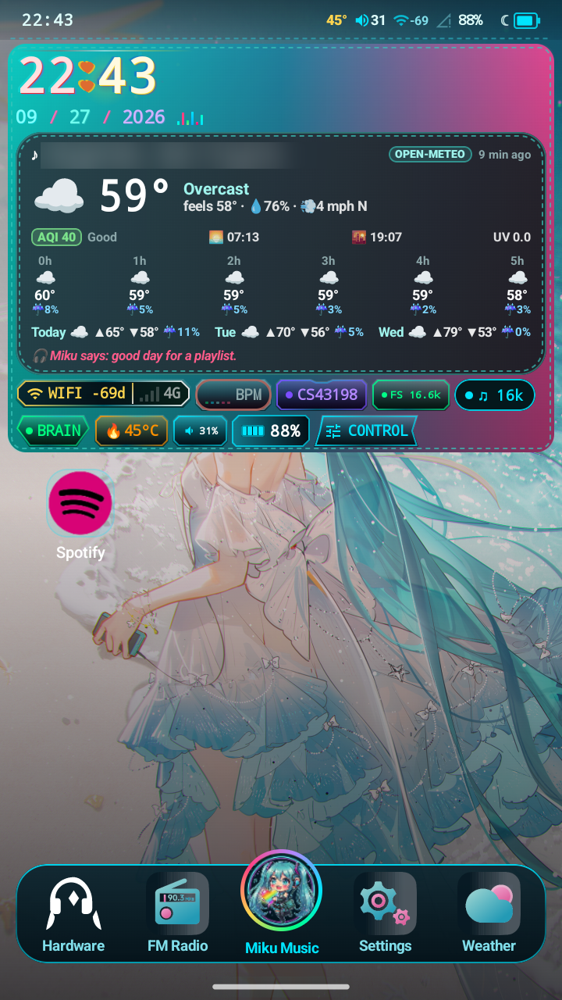
  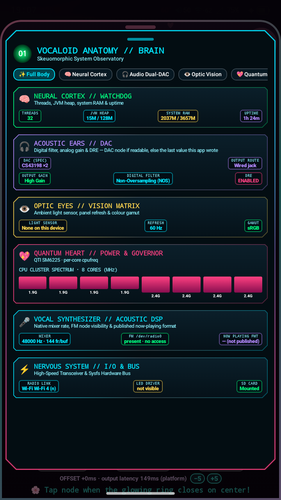
  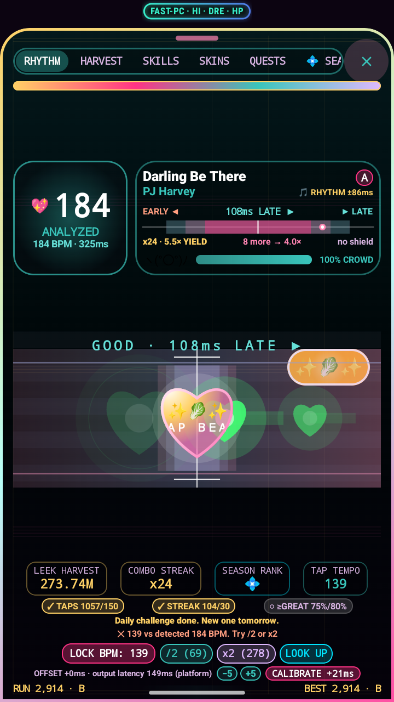
</p>

---

## Contents

- [What is verified](#what-is-verified)
- [Installing](#installing)
- [What is in the OS](#what-is-in-the-os)
- [Miku Music](#miku-music)
- [The launcher](#the-launcher)
- [System UI](#system-ui)
- [Settings and hardware](#settings-and-hardware)
- [DAC settings and the NOS filter](#dac-settings-and-the-nos-filter)
- [Battery and charging](#battery-and-charging)
- [The bit-perfect audio path](#the-bit-perfect-audio-path)
- [FM radio](#fm-radio)
- [Android Auto](#android-auto)
- [Apps that replace the stock ones](#apps-that-replace-the-stock-ones)
- [Updates over the air](#updates-over-the-air)
- [Voice and sounds](#voice-and-sounds)
- [Boot video and popup art](#boot-video-and-popup-art)
- [Easter eggs](#easter-eggs)
- [The poor man's ambient light sensor](#the-poor-mans-ambient-light-sensor)
- [Making it fast](#making-it-fast)
- [Building an image](#building-an-image)
- [Flashing](#flashing)
- [Signing and keys](#signing-and-keys)
- [Hard-won platform facts](#hard-won-platform-facts)
- [Repo structure](#repo-structure)
- [The device](#the-device)
- [What we keep from HiBy and what we replace](#what-we-keep-from-hiby-and-what-we-replace)
- [Known limitations](#known-limitations)
- [Contributing](#contributing)
- [Legal](#legal)
- [Attributions](ATTRIBUTIONS.md)
- [Full source OS roadmap](docs/11_full_source_os_roadmap.md)

---

## What is verified

The line between confirmed on real hardware and not. It is the first section on purpose.

Legend: **Yes** confirmed on a real M500. **Not yet** built and in the image, not confirmed on
hardware. **No** tried, does not work.

Things new in 0.3.0 are marked Not yet until they have been tested on the device. The 0.3.0 rows
marked Yes were confirmed on 2026-10-10.

| Thing | State | How it was checked |
|---|---|---|
| Platform-signed apps, no root | Yes | Running daily. `su` is never invoked anywhere in the shipped code |
| Re-keyed system image boots | Yes | Known-good image `mikuos_super_rekey1_GOOD_20260827.img`, boot-verified |
| APEX re-signing to a custom key | Yes | Proven on `com.android.mediaprovider`, compressed `.capex` included |
| Bit-perfect DIRECT output to the DACs | Yes | 44.1 / 48 / 192kHz, 24-bit packed, confirmed with `dumpsys media.audio_flinger` |
| Gesture navigation replacing the stock nav bar | Yes | An accessibility service IS the navigation on this device |
| Suppressing the stock nav pill | Yes | `StatusBarManager` disable flags. `NavigationBar0` reports `isVisible=false` after a reboot |
| OS-wide idle dim on real system brightness | Yes | Four-tier ladder writing `Settings.System.SCREEN_BRIGHTNESS` |
| Fn-key pocket lock without root | Yes | HiBy's framework honors `Settings.Global button_lock` |
| Camera used as an ambient light sensor | Yes | See below. The device has no ALS at all |
| Custom LED behavior | Yes | `miku_led.rc` baked into vendor, needs a reflash to take |
| Last.fm scrobbling | Yes | Browser token flow, per-user session key. App key lives in `local.properties`, never the repo |
| GPS as the primary position source | Not yet | Single-shot, timed out, cached two hours. The path is verified falling back correctly indoors. An actual satellite fix still needs testing outdoors |
| Wi-Fi positioning without Google location | Yes | BeaconDB then Apple WPS, with travelling-AP exclusion. Now the fallback rather than the primary |
| Automatic time zone while travelling | Yes | Taken from the weather position, since NITZ needs a carrier registration this SIM is denied. Verified correcting America/Denver to America/New_York on-device |
| WireGuard client in the launcher | Not yet | Implemented, the VPS-relay path for CGNAT is the untested part |
| Bluetooth LDAC push | Not yet | Codec enforcement is implemented, unproven until an LDAC sink is on hand |
| Web installer (WebUSB fastboot) | Not yet | Hosted at `mikuos.falcontechnix.com` in bring-your-own-images mode. `EXPECTED_PRODUCTS` still unconfirmed |
| Full AOSP-from-source build | No | The tree and `device/hiby/m500` exist and the lunch target is defined, but `out/` is empty: this has NEVER produced an image. What ships is the stock image re-keyed. Plan, costs and timeline in [the roadmap](docs/11_full_source_os_roadmap.md) |
| Reading the DAC state back | Yes | Not from sysfs, which SELinux denies to `platform_app`. From `vendor.audio.hiby.*`, which is the namespace the vendor's own audio HAL reads and writes. The panel names which source answered |
| GSI (generic system image) | No | Vendor mandates six legacy HIDL services Android 14 dropped. Abandoned for a stock-QSSI base |
| FM tuner | Yes | Audible on 0.1.15, 2026-10-09. Ships as `com.caf.fmradio`, platform-signed and bundled in `system_ext`, which is what SELinux keys on. An `adb install`ed copy in `/data` shadows the bundled one and fails as "TUNER ERROR". `adb uninstall com.caf.fmradio` falls back to the bundled app |
| FM RDS text | Yes | On 0.1.17, 2026-10-10, a strong station (WVAQ 101.9) showed its program type and RadioText. Needs the patched Si4705 driver (`os/patch_si4705_rds.py`). Weak stations show no RDS. See [FM radio](#fm-radio) for why stock never showed it either |
| FM stereo indicator and the lower stereo blend thresholds | Not yet | From the Si4705's own pilot and blend report, which the same driver patch exposes. Weak stations read mono indoors, which is the chip's default blend. 0.3.0 lowers the blend thresholds |
| FM song ID | Yes | On 0.3.0, 2026-10-10, on the 4.4mm output, it named the song playing on a weak station (RSSI 12, mono). The capture that came back silent on wired outputs on 0.1.15 carried the radio audio this time |
| FM reception estimates | Not yet | The offset is calibrated from tuner readings of two local stations. The estimates have not been checked station by station |
| FM spectrum, waterfall, NOAA list, NWS alerts | Yes | Seen working on 0.3.0, 2026-10-10, while taking the screenshots in this README: a live FFT and waterfall of the radio audio on 4.4mm, the transmitter list, and a live NWS alert |
| Android Auto bundled as a privileged app | Yes | On 0.3.0. Android Auto refuses to run as anything else |
| Android Auto in a car | Not yet | Miku Music and Miku FM register as media sources. Not tested with a car yet, so whether audio reaches it over a wired connection is unverified |
| NOS filter selectable, on HiBy's 1.30 DAC driver | Yes | On 0.3.0. The fix is confirmed by disassembly, against Cirrus's register layout, and against HiBy's own 1.30 driver |
| NOS filter audible | Not yet | No listening test yet. The chip's filter register cannot be read back without root |
| DAC settings reaching the hardware (high power, DRE, filter, gain) | Yes | Through the system bridge and `miku_audio.rc`. Confirmed on 0.3.0 from the driver's own kernel log: each change is a `cs43198_i2c_write_reg` on both DACs (`0x30` and `0x33`). That is what the driver wrote, not a read of the chip |
| HiBy 1.30 fuel gauge and health HAL | Not yet | Hashes, vermagic and symbol CRCs checked against the 1.20 kernel at build time. Not run on hardware |
| Notification sounds | Yes | On 0.3.0, with the `playSound()` patch to the 1.20 `services.jar` |
| Charge limit | Not yet | The SELinux rule it needs compiles on the device. Holding at the limit has not been observed yet |
| CPU power profiles | Yes | The system bridge sets the profile and init writes the CPU frequency caps. Read back from cpufreq on 0.3.0 |
| Boot-time settings | Yes | Applied by the system bridge, because init refused the old rc. Read back from Settings on 0.3.0 |
| adb needs key authorization | Yes | `ro.adb.secure=1` on 0.3.0 |
| Screen lock PIN or password | Yes | Set, change and remove, and the trust agent, on 0.3.0 |
| "Ask for PIN only after restart" | Not yet | The reboot path is still to be tested |
| Miku shade | Yes | Receives notifications and opens from any app, on 0.3.0 |
| MikuSettings as the only Settings | Not yet | Installed as a priv-app. The build checks its privileged permissions against the allowlist |
| System UI changes in 0.3.0 | Not yet | Rotation lock tile, editable quick settings, brightness and volume bars, back from both edges, status bar handling, no USB pop-up |
| Clock, Calculator, Calendar, Camera, Gallery, Recorder | Not yet | MikuTools and MikuMedia |
| Miku Update | Not yet | |
| Voice clips | Not yet | All 324 voice clips pass an off-device check (Whisper hears the words that were intended). Playback on the device not confirmed |
| Riot mode, MikuPod | Yes | Both run on 0.3.0 with haptics, and play FM through the FM app's media session |
| Playing to every connected output at once | Not yet | 4.4mm and a USB headset playing together, confirmed in the log on 2.0.311. The newer timestamp-based sync and the per-output volume sliders are not confirmed on hardware |
| Kernel 5.15.209 | No | A/B proven to break charging: `mp2731` never qualifies the input and the device drains on the cable. Stock 5.15.153 stays |

---

## Installing

There is no prebuilt image to download, and there will not be one. A MikuOS super image contains
HiBy Digital's system and vendor firmware, which is not ours to hand out. You build it from the
stock firmware you already have on your own device. See [Building an image](#building-an-image).

Once you have an image, there are two ways to put it on the device.

**From a browser.** `mikuos.falcontechnix.com` serves the WebUSB installer. It talks fastboot from
Chrome, takes the images you supply, splits super into 64MB chunks and resumes if the transfer
drops. It does not host any images. Treat it as a flashing tool, not a download.

**From a shell.** The scripts under `os/` do the same job with more output when something
goes wrong, which is the reason to prefer them the first time.

```bash
# Keeps /data: likes, history, WiFi, installed apps
./os/flash_mikuos_keepdata.sh

# Wipes /data
./os/flash_mikuos_clean.sh
```

Read [Flashing](#flashing) before either one. The failure modes on this device are specific and a
couple of them look like a dead device when they are not.

Once it is installed, newer builds of the MikuOS apps can come over the air through Miku Update.
Anything outside the apps is still a new image. See [Updates over the air](#updates-over-the-air).

---

## What is in the OS

| Component | Package | What it does |
|---|---|---|
| **Miku Music** | `com.miku.player` | The player. Bit-perfect, libprojectM, cassette deck, listening profiles. [Its own repo](https://github.com/sworrl/MikuMusic) |
| **Launcher** | `com.miku.launcher` | Home screen, app drawer, lockscreen, AOD, weather, GPS map, network and battery observatories, the ingest engine, the BPM game |
| **System UI** | `com.miku.systemui` | Gesture navigation, the Miku shade, quick settings, power menu, recents, idle dim, the DAC badge |
| **Settings** | `com.miku.settings` | The MikuOS settings app, installed as a privileged app |
| **Hardware** | `com.m500.hardware` | DAC filter, DRE, gain, high-power mode, thermal, the camera light meter |
| **System bridge** | `com.miku.sysbridge` | The one MikuOS app that runs as the system UID. Sets the DAC, USB and charge-limit properties no other app is allowed to, and carries the FM app's network requests |
| **Miku FM** | `com.caf.fmradio` | The FM radio. Has to be bundled in the image to reach the tuner |
| **MikuTools** | `com.miku.tools` | Clock, Calculator, Calendar |
| **MikuMedia** | `com.miku.media` | Camera, Gallery, Recorder |
| **Miku Update** | `com.miku.update` | Over-the-air updates of the MikuOS apps |
| **Riot mode** | `com.miku.riot` | Easter egg |
| **MikuPod** | `com.miku.wheel` | Easter egg |
| **Android Auto** | `com.google.android.projection.gearhead` | Google's app, bundled exactly as Google signed it. You supply the APKs |

All of the MikuOS apps are Gradle modules of one build, together with Miku Music, so they share its
theme, motion and audio code.

---

## Miku Music

The player is the reason the rest of it exists. It is a native Kotlin and Compose app, not a fork
of HiBy's.

<p align="center">
  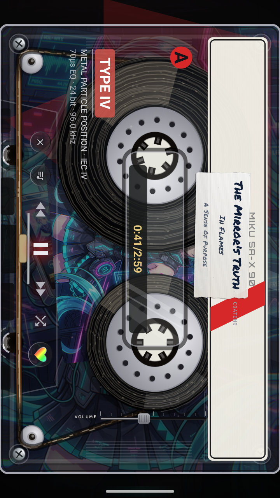
  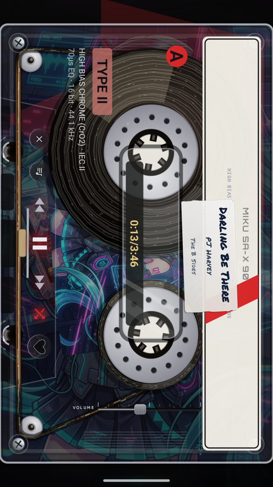
  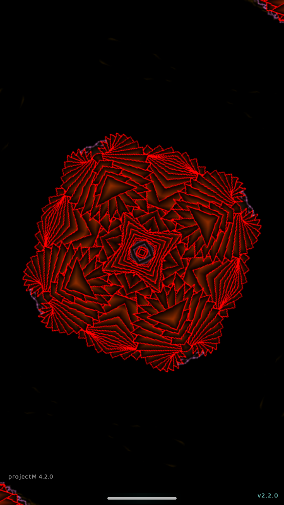
</p>

Those first two are the same screen on two different tracks. The masking tape's position, angle,
paper, torn edges and grime are rolled per track from the track id, so the strip lands somewhere
plausible rather than in the same spot every time. The two drive holes are drawn last, over the top
of it, because they are holes through the shell and nothing can sit on them.

<p align="center">
  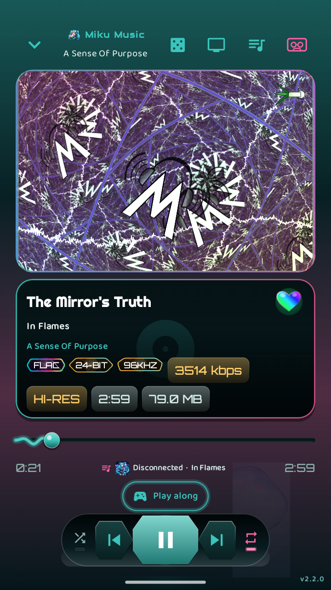
  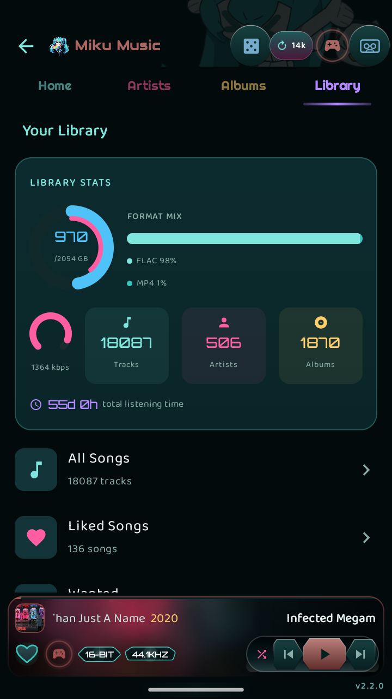
  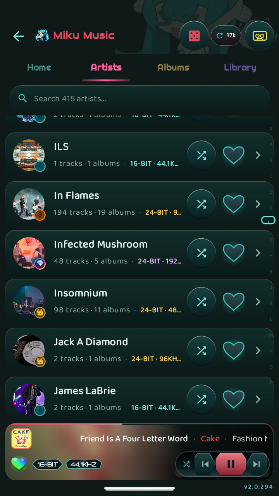
</p>

**Library.** Around 18,000 tracks and 500 artists on the author's card. The library is cached in a
flat store keyed on `MediaStore.getGeneration`, so a launch where nothing changed skips the
MediaStore walk entirely. A rescan is debounced and single-flighted, because a naive implementation
kicked off five concurrent walks and ANR-killed the playback service.

**Real format data, not guesses.** Sample rate and bit depth come from `MediaMetadataRetriever` on
the actual file, stored in an on-device database. Nothing is inferred from a file extension. Where
the value is not known, the UI shows a dash.

**Disc images and cue sheets.** A single-file album with a `.cue` is split on the cue. Around 489
disc images have no cue sheet at all, and those are matched against MusicBrainz track durations.

**Tape mode.** A Compact Cassette drawn in millimetre coordinates to the IEC 60094-7 mechanical
spec: 101.6 by 63.5mm shell, hubs 42.5mm apart on the 28.4mm line, guide rollers at the bottom
corners, head and capstan openings on the bottom edge, rotated onto the portrait panel. The reels
turn at a rate derived from playback position, the masking tape label carries handwriting in one of
several marker styles, and the volume fader is part of the deck rather than a system modal.

**Visualizer.** libprojectM at master (4.2.0), with 9,825 presets shipped in the APK assets. All of
them have been loaded once on the GL thread by a self-test broadcast to find the ones that fail.

**Listening profiles.** A profile is the headphone or output you are listening on, the EQ and DSP
that suit it, and the DAC settings to use with it (gain, high power, filter, DRE). Profiles can
switch with the output device. The built-in ones come from AutoEq measurements and the makers'
published sensitivity and impedance, through `tools/profiles/gen_listening_profiles.py`. A model
with no measurement ships flat and says so. Your changes are saved as the differences from the
recommended settings, not as a copy of them, so "reset to recommended" just drops them, and a later
data refresh still reaches every field you never touched.

**Listening stats and scrobbling.** A local listen database drives a stats screen and an annual
recap. Last.fm scrobbling uses the browser token flow: the app never sees a password, each user
signs in to their own account, and the session key stays in that device's encrypted preferences.

**Songs liked off the radio.** A like in Miku FM lands in Miku Music as a Wanted track, a liked
song the library does not have yet, with the station, frequency, time and place it was heard.

**Android Auto.** Miku Music is a media source in Android Auto. See [Android Auto](#android-auto).

**Other things that are in there.** A skeuomorphic booklet and sleeve viewer that reads scans out of
the album folder. Artist photos matched against Wikidata and Wikipedia on an exact match only, with
a local override and a reject button. An affinity and co-occurrence model behind a radio station
mode and an optional smart shuffle, both gated on having real play counts. An alarm clock that wakes
the device and rings over the lockscreen. A BLE remote peripheral, off by default, paired with a six
digit code.

<p align="center">
  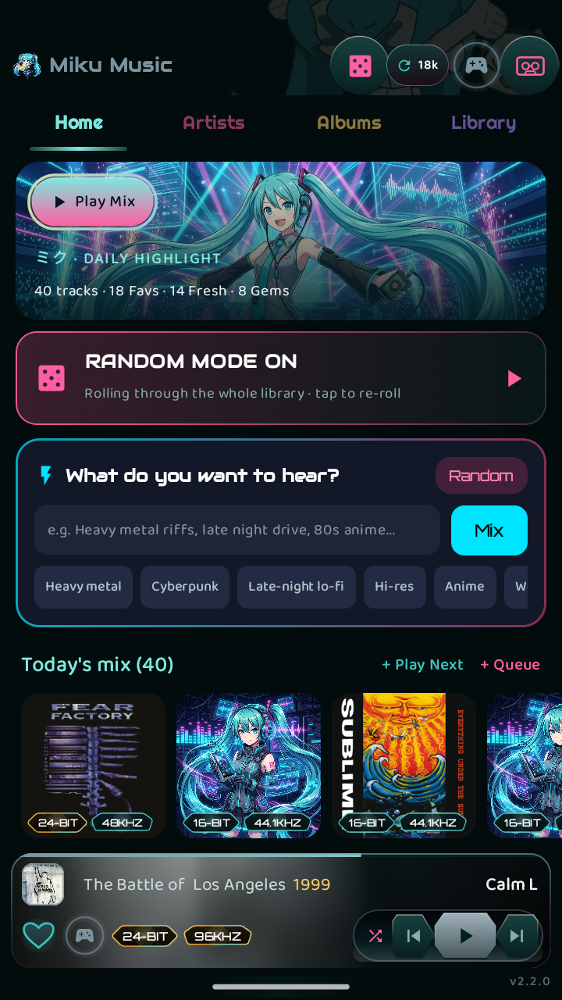
  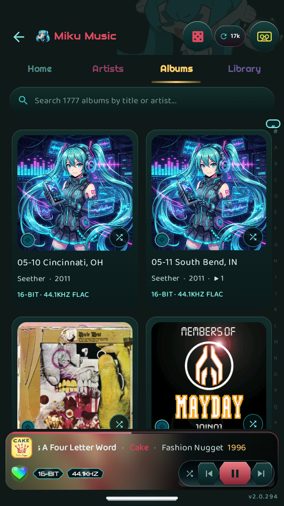
  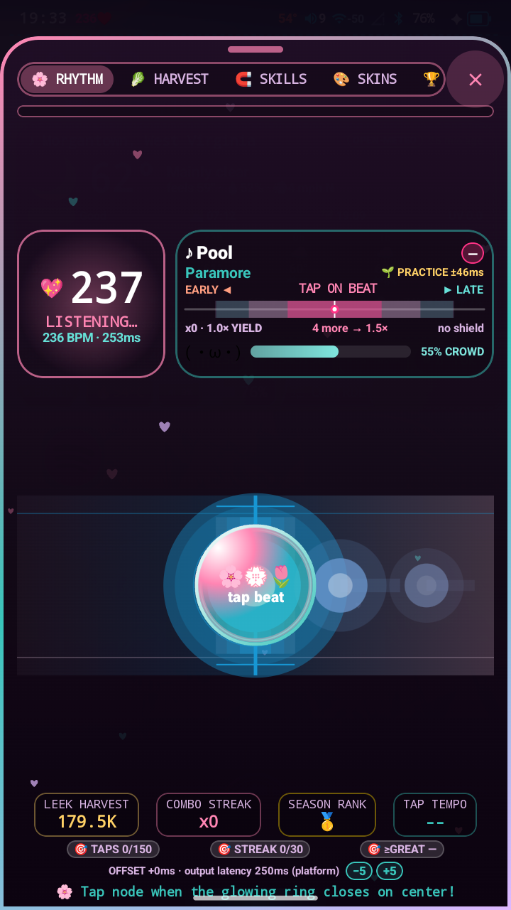
</p>

---

## The launcher

<p align="center">
  
  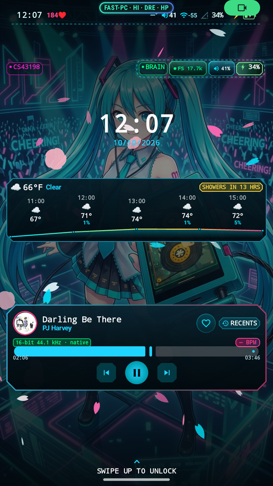
  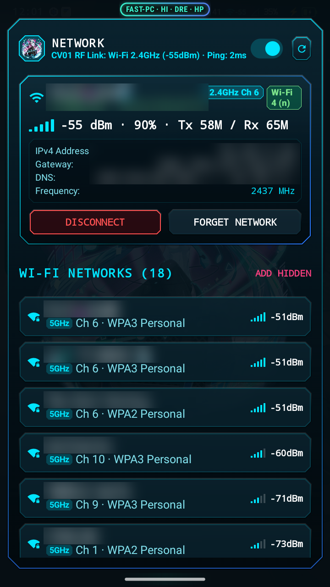
</p>

Network names, addresses and the town are blurred in these captures and the FM ones further down. `tools/blur_pii.py` is the
helper that does it, so the same regions can be stripped again from a fresh screenshot rather than
being redacted by hand.

**Weather and location.** Open-Meteo for forecast, with real AQI. The interesting part is location.

The device has real GNSS hardware and for a long time nothing used it. The launcher only ever read
`getLastKnownLocation`, which is a passive read of a cache something else has to fill, and nothing
on this device fills it: no maps app, no navigation, nothing subscribing. `dumpsys location`
reported zero fixes across ten hours. So the launcher now asks the satellites itself, as a single
bounded shot rather than a subscription, because GPS was pulled out of this launcher once already
for flattening the battery. One fix, a hard timeout, cached for two hours, and the radio goes back
to sleep either way.

A fix needs sky and this is a pocket player, so when GPS comes back empty the launcher falls through
to its own Wi-Fi positioning: it scans, then asks BeaconDB and falls back to Apple's WPS, both
keyless.

That naive version was wrong in a way worth writing down. It kept reporting the author's old address
from across the country, and it was right to, because the access points it could hear travelled with
him: four Starlink terminals, a phone hotspot, and his own gear, all mapped at the old location. The
locator now keeps a list of SSIDs that move and excludes them from the fix.

**The BPM game.** Tap along to the beat of whatever is playing, against a note highway that takes
its colors from the album art. It keeps a crowd meter and it will heckle you. Miku Music has its own
buttons into it, so it is not only reachable from the launcher.

Playing it unlocks things around the OS. There is a visible ladder of unlocks, each one tied to
something that actually exists in the code. There is also a hidden tier the game never lists. It
shows how many secrets are left and one hint a day, and you find out what a secret is when you earn
it. The two [easter eggs](#easter-eggs) are in there.

**The clock follows you.** The system time zone used to sit wherever it was last set, because
Android's automatic time zone is driven by NITZ and NITZ needs a carrier registration this
data-only SIM is usually denied. The launcher already asks Open-Meteo with `timezone=auto` for the
weather, and Open-Meteo already answers with the IANA zone for those coordinates, so that value now
sets the system zone. It applies from the cached reading as well as a fresh one, so a cold boot
does not wait for the network to know what time it is. `settings put global miku_auto_timezone 0`
pins the zone if you would rather set it by hand.

**Observatories.** Network and battery screens that show measured values. The battery one reads the
CellWise CW2015 fuel gauge and the MP2731 PMIC.

**The ingest engine.** Watches for an SD card mount and runs a scan, with a daily pass as a backstop.
An early version answered `ACTION_MEDIA_SCANNER_FINISHED` by starting another scan, which is an
endless rescan loop that pinned MediaProvider and the card. Do not start work from the broadcast that
signals that work finished.

---

## System UI

**Navigation is an accessibility service.** The stock navigation bar is suppressed in the
configuration MikuOS ships, so the gesture pill is drawn by `com.miku.systemui` and the
accessibility service performs the global actions. It follows your finger and shifts color to stay
legible against what is behind it. Back is a swipe in from either edge.

There was a duplicate for a long time: AOSP's own `NavigationBar0` and `SecondaryHomeHandle0`, plain
and unresponsive, drawn system-wide underneath ours. Hiding the insets per-app does not remove it,
and the framework RRO route does not work either, because idmap only maps two of the three
resources and `config_showNavigationBar` is the one it excludes. What does work is the
`StatusBarManager` disable flags, and after a reboot `NavigationBar0` reports `isVisible=false`.

**One rule about the navigation service.** Never `am force-stop com.miku.systemui`. Android drops a
force-stopped package from `enabled_accessibility_services`, which means the device loses its
navigation until you re-enable it by hand.

**The status bar.** The stock status bar shows in other apps. While a Miku screen is in front, which
draws its own, the stock one is blanked so there are not two.

**The Miku shade.** Pull down from the top edge in any app and the Miku shade opens: clock, quick
settings, brightness, the media player and your notifications. The stock pull-down is blocked, so
there is only one shade.

**Quick settings** are editable: add, remove and reorder tiles. There is a rotation lock tile. The
shade has a brightness bar at the top, and there is a volume bar.

**The DAC badge.** A small chip in the middle of the status bar names the DAC settings that were
applied, for example `FAST-PC · HI · DRE · HP` (filter, gain, DRE, high power), colored to match.
It reads what the system bridge applied, not what an app asked for. It also sits over full-screen
video, since an overlay can't tell when another app hides the bar. The DAC badge tile, or
`settings put global miku_dac_badge 0`, turns it off.

<p align="center">
  
</p>

**No random USB pop-up.** The USB mode chooser no longer shows up on its own, and it stays away when
a car connects for Android Auto.

**Idle dim** walks real system brightness down a four-tier ladder and puts it back on touch.

**The Pulsar LED.** The solid blue light on the front is HiBy's standby glow, not an activity
light. HiBy's vendor init writes `led_pattern 1` at boot, and on stock, HiBy Music changed
`sample_quality` per track so the color showed the format (patterns 2 through 10). Once HiBy Music
is gone nothing updates it, so the light sat solid blue forever. Apps cannot reach it:
`/sys/class/leds` is SELinux-denied and `LightsManager` reports no lights. Only init can, so MikuOS
bakes `miku_led.rc` into vendor, which turns the standby glow off. That needs a reflash rather than
a setting, and it is why the old lighting settings page is gone. Showing the format again would
mean setting `sample_quality` per track from a privileged context, which is not done yet.

**Notification sounds work.** HiBy's 1.20 `services.jar` has a `NotificationManagerService.playSound()`
that checks audio focus, reads the volume and then returns `false` without playing anything, so no
notification on 1.20 ever made a sound. HiBy put the AOSP body back in 1.30.
`os/patch_services_notif_sound.py` does the same to the 1.20 jar, that one method only. MikuOS
does not take the 1.30 `services.jar` whole, because 1.30 also adds a binder method that sets
system properties with no permission check (section 4 of
[the firmware history](docs/research/hiby-firmware-history.md)).

<p align="center">
  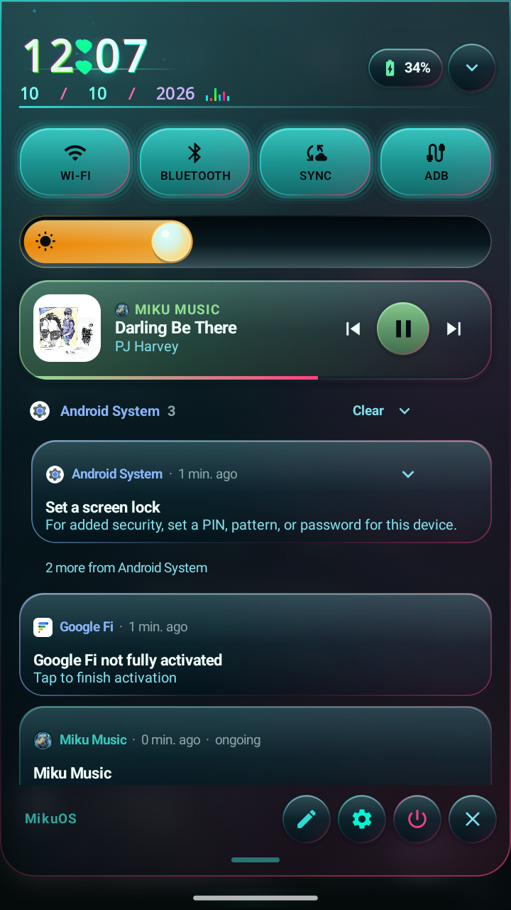
</p>

---

## Settings and hardware

<p align="center">
  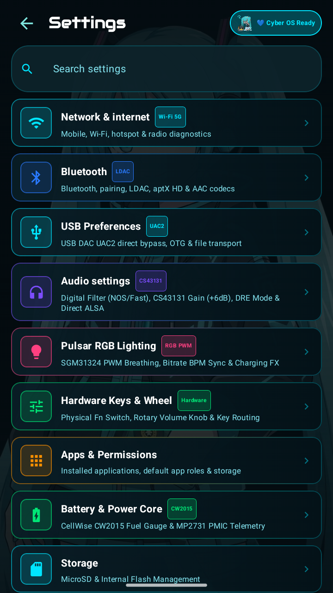
  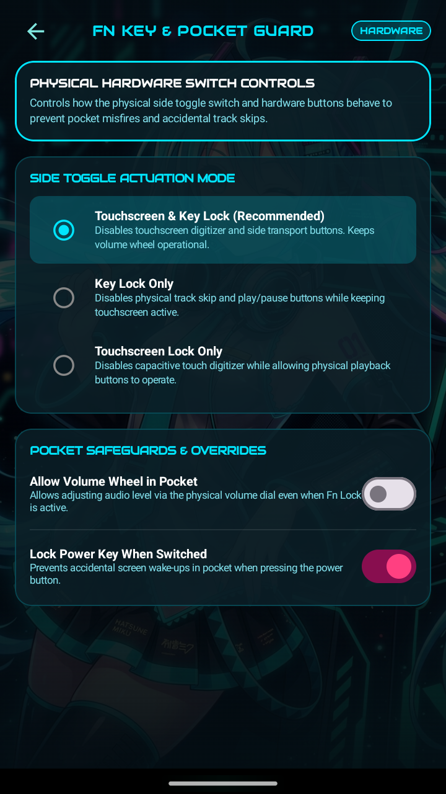
  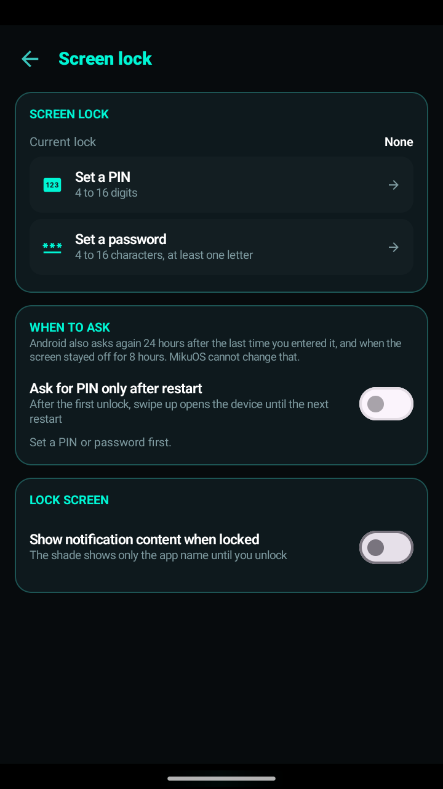
</p>

`com.miku.settings` covers network, Bluetooth, USB, audio, display, hardware keys, apps, battery,
security, location and storage. `com.m500.hardware` owns the DAC controls and the camera light meter, and runs the Fn
lock daemon in a foreground service so the pocket lock stays applied.

**One Settings app.** MikuSettings is installed in `system/priv-app` and is the only Settings app you
see. It has to be privileged. Android resets `android:priority` to 0 for any app outside priv-app,
so stock Settings used to win or tie every `android.settings.*` intent and you got a chooser
between two Settings apps. The stock Settings APK is still in the image with its launcher entry
disabled, because it still hosts a few system flows MikuSettings does not rebuild yet. The full map of every stock entry point and where it goes is in
[docs/research/settings-parity.md](docs/research/settings-parity.md).

This device enforces the privileged permission allowlist and makes no exception for
platform-signed apps, so a single missing entry stops the device at boot. `os/check_privapp.py`
compares what the APK asks for against the allowlist and fails the build instead.

**Screen lock.** Settings, Security & privacy, Screen lock sets, changes and removes a PIN or
password in MikuSettings itself. "Ask for PIN only after restart" asks for it on the first unlock
after a reboot, then lets a swipe open the device until the next restart, through a trust agent.
Android still asks again 24 hours after the PIN was last entered and after the screen has been off
for 8 hours, and MikuOS cannot change that. On the lock screen the shade shows only the app name of
a notification unless you turn content on.

**CPU power profiles.** Miku Music picks a profile (perf, balanced, audio only or idle) and the
system bridge sets it. init then writes the CPU frequency caps, since init can write cpufreq and
apps cannot. While charging, the two saving profiles go up to balanced. This replaces a root shell
loop that init never started, because on this user build init refuses a service with no SELinux
domain.

**Boot-time settings.** The default keyboard, the stock Settings launcher entry, a few app-ops and
permission grants and the like used to be applied by an init rc that ran `settings`, `pm` and
`appops`. On this enforcing build init refused every line, so none of it was ever applied. The
system bridge applies them now, every boot for system plumbing, and only once for anything that is
a user preference so a later change sticks.

**adb** needs key authorization (`ro.adb.secure=1`).

**The volume wheel.** HiBy's framework puts a per-jack raise-lock on `adjustStreamVolume`, which
gates the wheel's path specifically. Using `setStreamVolume` instead goes around it.

**Bluetooth pairing.** Bonding needs something to answer `ACTION_PAIRING_REQUEST`. Without a
responder, `createBond()` looks like it silently fails. The controller now auto-confirms passkey
confirmation and consent variants.

---

## DAC settings and the NOS filter

The M500 has two Cirrus Logic CS43198 DACs, one at I2C 0x30 and a second at 0x33 for 4.4mm
balanced. HiBy's audio driver exposes 31 nodes under `/sys/devices/platform/sa_sound_setting`, and
four of them change hardware on the M500: `high_power_mode`, `dre_mode`, `digital_filter` and
`gain`. The rest (R2R, tube, class A/AB, MQA, timbre and so on) belong to other HiBy players that
share the driver. They accept a value and nothing happens.

**Before 0.2.0, MikuOS reached none of the four.** HiBy applies them through init triggers on
`vendor.audio.hiby.*` properties, set at boot by a HiBy system service that only runs when the
model is named M500 or M500_MIKU. MikuOS renames the model. Apps cannot set those properties
themselves either. So the DAC sat on driver defaults: low power, DRE off, fast roll-off low
latency, 0 dB.

From 0.2.0 the settings go through `com.miku.sysbridge`, the one MikuOS package that runs as the
system UID, which HiBy's SELinux policy allows to set vendor audio properties. It sets
`persist.vendor.audio.miku.*` from a fixed list, and a vendor init file, `miku_audio.rc`, writes the
node on every change and again at every boot. Details in
[docs/research/hiby-audio-knobs.md](docs/research/hiby-audio-knobs.md).

On 0.3.0 this is confirmed on hardware. Every change shows up in the driver's own kernel log as a
`cs43198_i2c_write_reg` to both DACs, `0x30` and `0x33`. That is what the driver wrote. Reading the
chip's registers back directly needs root.

<p align="center">
  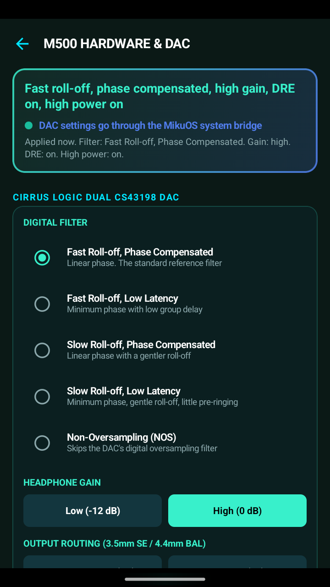
</p>

**NOS.** The CS43198 has a non-oversampling filter mode, bit 5 of its filter register. Through
firmware 1.20, HiBy's driver picked the right value for NOS and then wrote it with a mask that let
only bits 7 and 6 through, so choosing NOS gave you fast roll-off, low latency. HiBy fixed the mask
in 1.30. 1.30 also writes the second DAC whatever the output is. In 1.20 it was only written in
balanced mode, so a filter, DRE or sample rate change made on 3.5mm never reached the 4.4mm DAC.

MikuOS 0.3.0 ships HiBy's own 1.30 build of that driver, `cs43198_dlkm.ko`, in place of the 1.20
one. MikuOS stays on the 1.20 kernel, so `os/adopt_hiby130.py` checks before it swaps anything: the
exact hash of both files, the vermagic, and every imported symbol's CRC against what the 1.20
kernel exports. If you only have the 1.20 firmware, the build falls back to
`os/patch_cs43198_nos.py`, which changes the mask at the four places it is used (four bytes) and
leaves the balanced-only writes as they were.

The fix is confirmed by disassembly, against the datasheet's register layout, and against HiBy's
1.30 driver. On 0.3.0 NOS can be picked and reaches the driver like the other filters. It has not
had a listening test yet, and the filter register cannot be read back from the chip without root. The full write-up is
[docs/research/m500-nos-filter.md](docs/research/m500-nos-filter.md).

---

## Battery and charging

**Fuel gauge.** The 1.20 `cw2015_battery.ko` has its charging state hard-wired off and writes three
log lines every 2 seconds. MikuOS 0.3.0 uses HiBy's 1.30 build, which reads charging from the
MP2731 charger and smooths the percentage (at most 0.5% per 2 second step, and it only goes up
while charging). Same CRC checks as the DAC driver.

**Health HAL.** The 1.20 health HAL looks for the `mp2731-charger` power supply once at start. If
the charger driver has not registered yet, it falls back to paths that do not exist on the M500 and
keeps them until the HAL restarts. HiBy's 1.30 build waits up to 2 seconds for it, and that is the
one MikuOS ships.

**Charge limit.** Settings has a charge limit: Off, 80, 85 or 90%. When the battery reaches the limit
on the cable, the system bridge holds it there, and lets go once it drops 5% below or the cable comes
out. The MP2731 charger has no switch to stop charging, so a hold drops its input current to the
lowest it goes, about 100 mA. That is not a hard stop, so the level may drift while it is held.

This is not yet observed on hardware. The SELinux rule the hold needs compiles on the device.

<p align="center">
  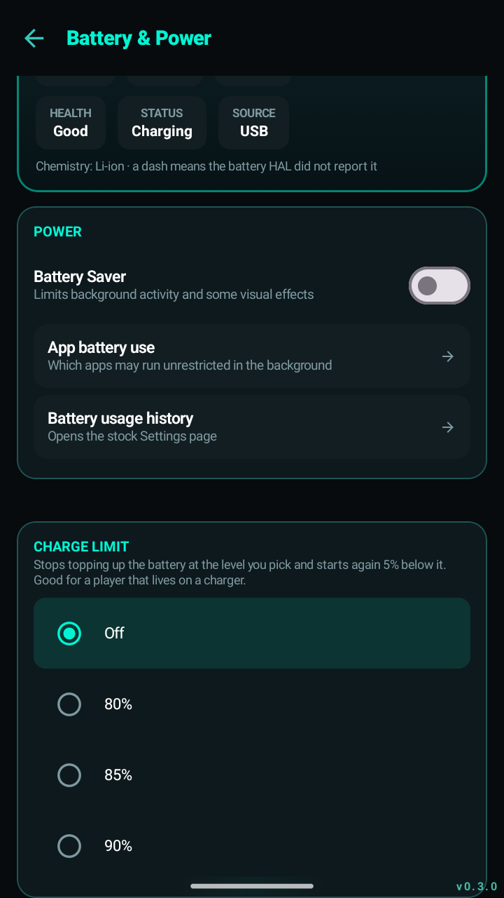
</p>

---

## The bit-perfect audio path

This is the problem the project was started for, and the answer took a while.

Android promotes an `AudioTrack` to `FLAG_DEEP_BUFFER` at around 100ms of buffering. Qualcomm's
`direct_pcm` output only routes when the flags are NONE. So anything that lands in the deep-buffer
path is silently opted out of DIRECT output, gets mixed, and gets resampled on the way to a pair of
DACs bought for not needing that.

The bug in our own sink was subtler than the platform behavior. It asked for a small buffer, then
clamped it with `max(getAudioTrackMinBufferSize(), ...)`, and on this device the platform minimum is
roughly twice the deep-buffer threshold. Every track was therefore deep-buffered onto a 192kHz mixer
no matter what was requested. It now requests the small buffer and only falls back to the platform
minimum when it has to.

Verified DIRECT at the file's native rate, 24-bit packed, in `dumpsys media.audio_flinger`. There is
a capture of that output in [`docs/screenshots/bitperfect-audioflinger.txt`](docs/screenshots/bitperfect-audioflinger.txt).

Bluetooth is deliberately excluded from the buffer shrink. A2DP wants the larger buffer and starves
without it.

### Playing to every output at once

With more than one output connected (wired, USB, Bluetooth, never the built-in speaker), Miku
Music plays to all of them. The original track stays as above, bit-perfect, pinned to the best
device present: the wired jack first, then USB, then Bluetooth. Every other output gets a mirror:
the same PCM, teed from the sink right after it is written, into a float `AudioTrack` pinned to
that device. Mirrors go through the mixer, so a 48kHz-only USB headset still plays a 96kHz file.

The outputs are kept in step by comparing what each one has presented, from
`AudioTrack.getTimestamp`, and correcting a mirror with a short gap or skip when the median of
several readings drifts past tolerance. `settings put global miku_audio_share_offset_ms <ms>`
nudges a mirror later (positive) or earlier. `miku_audio_share_enabled=0` turns it off, and unset
means on. Each output has its own volume slider while sharing. The old "dual audio matrix" sent
vendor parameters that do not exist, see [Hard-won platform facts](#hard-won-platform-facts).

---

## FM radio

Miku FM replaces HiBy's FM2. It keeps the package name `com.caf.fmradio` and the platform
signature, because SELinux puts that package in the `vendor_fm_app` domain, and that is the only
domain allowed to open the tuner at `/dev/radio0`. It also has to be bundled in the image rather
than installed, see the FM tuner row in [What is verified](#what-is-verified).

<p align="center">
  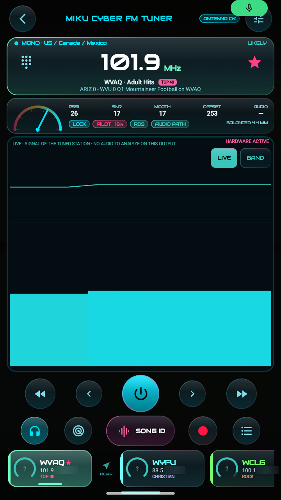
  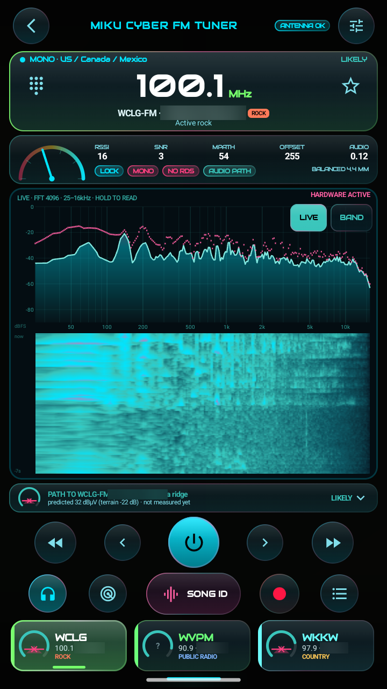
  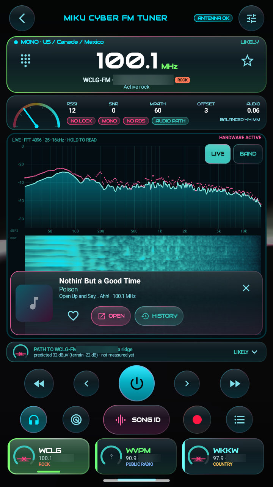
</p>

The town next to each station is blurred in these.

**The driver.** HiBy's Si4705 driver hid most of what the chip reports, and it is the same code in
1.30. `os/patch_si4705_rds.py` patches `radio-si4705-common.ko` in `vendor_dlkm`, and refuses to
run on anything but the stock module.

- **RDS.** The driver read all four blocks of each RDS group from the chip and copied only the first
  two to the app. The station name and RadioText are in the other two, so no app could ever show
  them. The patch copies all eight bytes. Confirmed on hardware on a strong station.
- **Stereo pilot.** The driver read the chip's stereo pilot and blend level and threw them away. The
  patch puts them where the vendor JNI already reads four bits.
- **Band.** The driver clamped every tune to a fixed table (87.0 to 108.0 MHz in practice). The patch
  widens the table so the chip decides. The chip itself accepts 64.0 to 108.0 MHz and rejects
  anything above. `MIKU_FM_UNLOCK=0` builds this part stock.
- **Stereo blend.** The driver never set the chip's blend thresholds, so the chip kept its defaults
  and went fully mono below RSSI 30 or SNR 14. The patch lowers the mono thresholds to RSSI 18 and SNR 6. Not yet confirmed
  on hardware. `MIKU_FM_STEREO=0` builds this part stock.

**Stations.** A catalog of 47,826 North American stations, every one with transmitter coordinates,
ERP and antenna height, built by `tools/radiodb` from FCC public-record data. Translators and LPFM
are in it, since those are a lot of what you actually hear. Formats and genres come from Wikipedia
infoboxes, and you can search and filter by genre. Logos are not in the image. They are other
people's trademarks, so the device fetches one when it needs it and caches it.

**Will I hear it from here.** Each station gets a reception estimate for where you are standing:
Egli path loss, extra loss past the radio horizon, and Fresnel knife-edge loss over the terrain in
between. An offset calibrated from band sweeps on the device brings the estimate in line with what
the tuner actually reads.

**Song ID.** It can name the song that is playing. It makes a signature from the last 12 seconds of
radio audio in Shazam's public signature format, the same one SongRec and shazamio make, and looks it
up. The lookup endpoint is undocumented and could stop working. A like goes to Miku Music as a
Wanted track, with the station, time and place it was heard. On 0.3.0 it named the song on a weak
station (RSSI 12, mono) from the 4.4mm output.

**Spectrum.** A 4096-point FFT of the radio audio, drawn as a spectrum and a waterfall, and a
projectM visual behind the dial. Song ID and the spectrum both need a capture of the radio audio,
and on wired outputs that capture came back silent on 0.1.15 (the `RADIO_TUNER` row in
[Hard-won platform facts](#hard-won-platform-facts)). On 0.3.0 it carried the radio audio on the
4.4mm output. The app checks that the capture is real audio before it uses it, and backs off if it
is not.

**Weather.** A list of the nearest NOAA Weather Radio transmitters, from NWS's own list of 1,035
sites, plus live NWS alerts for your position. The M500 cannot receive weather radio: NWR is at
162.400 to 162.550 MHz and the Si4705 stops at 108. The list is reference, for pointing a weather
radio or a scanner at the right channel.

<p align="center">
  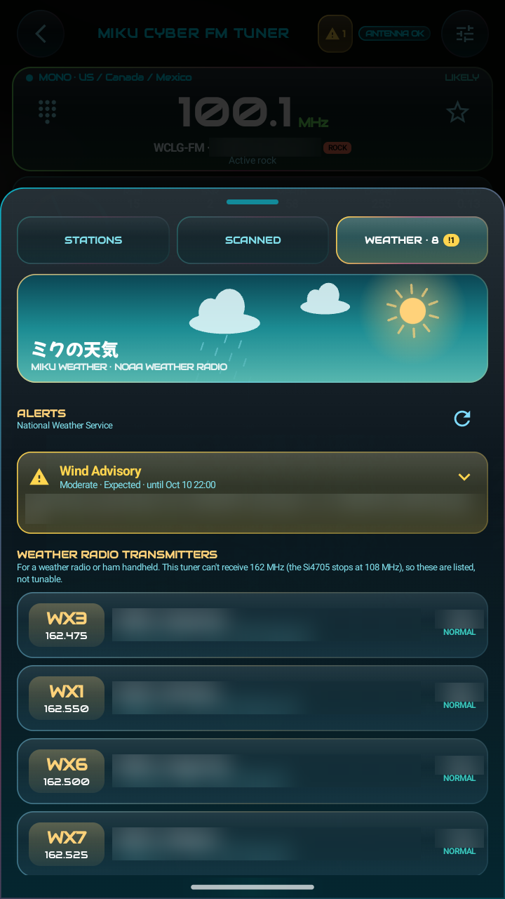
</p>

**Android Auto.** Miku FM is a media source in Android Auto, with presets, nearby stations and seek.

---

## Android Auto

Android Auto is not in AOSP and HiBy's GMS set does not include it, so Android 14 alone does not get
you Android Auto. Sideloading does not work either. Since Android 10 the app refuses to run unless
it is a privileged system app, which is the "must have been bundled with your OS" error.

So the build bundles it in `system_ext/priv-app/AndroidAuto`, as Google's own signed split APKs
(base, arm64, English, xxxhdpi), unmodified. Merging the splits into one APK would re-sign it, and
GMS checks this package's signature. The privileged permission allowlist is generated by
`tools/androidauto/prepare_android_auto.py`: the permissions the APK asks for, intersected with the
ones this build's framework marks privileged. The build fails if that list goes stale, for the same
bootloop reason as MikuSettings.

The APKs are not in this repo. Without them the build skips this step. `MIKUOS_ANDROID_AUTO=0`
skips it on purpose.

Miku Music and Miku FM are both media sources in the car. None of this has been tested with a car
yet, and whether audio reaches the car over a wired connection is unverified.

---

## Apps that replace the stock ones

| Stock | MikuOS |
|---|---|
| DeskClock, ExactCalculator, Calendar | MikuTools (`com.miku.tools`): Clock, Calculator, Calendar |
| SnapdragonCamera, Gallery2, HiBy's recorder | MikuMedia (`com.miku.media`): Camera, Gallery, Recorder |

The camera and recorder use the MikuOS [voice clips](#voice-and-sounds), so the self-timer counts
down and the shutter says "Say cheese!".

<p align="center">
  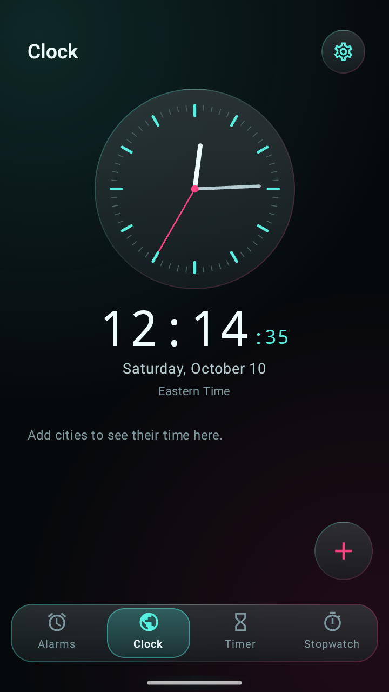
  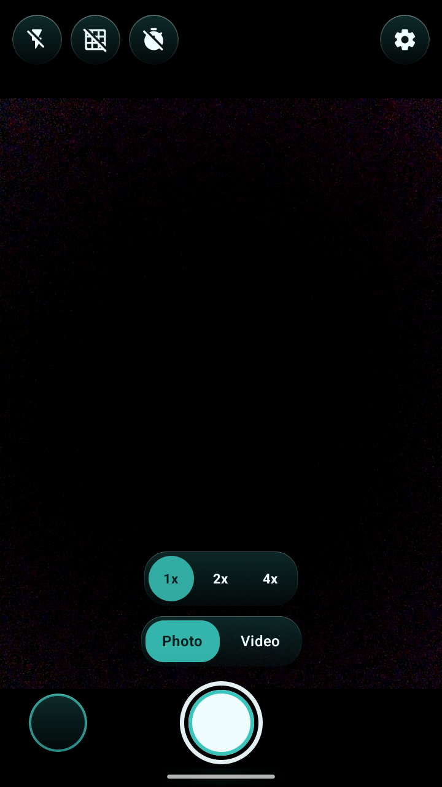
</p>

Each of those stock apps is the only handler of an intent other apps rely on (set an alarm, view a
photo, take a picture), so the build only removes a stock app when its replacement actually made it
into the image. `MIKU_NO_REPLACEMENTS=1` leaves the replacements out and keeps the stock apps.

**Also removed,** each checked against the image first so nothing in the OS depends on it: the
Android version easter egg, the AOSP screensavers (BasicDreams, PhotoTable), the browser bookmark
provider, Qualcomm's ride-mode audio, the stock Settings search, the accessibility floating menu,
the emergency info card, HiBy's factory test app and HiBy's home-screen widgets.

**False hardware.** The vendor image claims hardware the M500 does not have, from Qualcomm's
reference build: NFC, gyroscope, barometer, proximity sensor, light sensor and a front camera. The
M500 has an accelerometer, a magnetometer and one rear camera. Those feature files are removed, so
the Play Store stops offering apps that need the missing hardware and apps stop trying to use it.

---

## Updates over the air

Miku Update (`com.miku.update`) updates the MikuOS apps between images. It reads a signed manifest
from `https://mikuos.falcontechnix.com/ota/<channel>/` (stable, beta or dev) and installs newer
builds of the `com.miku.*` apps and `com.m500.hardware` as updates over the copies in the image.
It runs as the system UID, so the install does not need a tap.

<p align="center">
  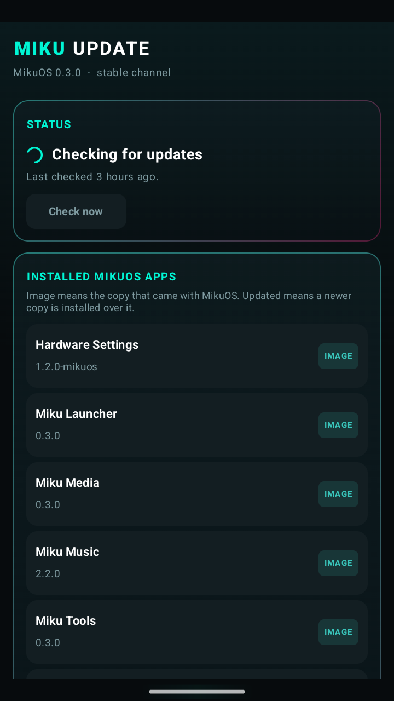
</p>

Before it installs anything it checks, in order:

1. The manifest's signature, ECDSA P-521 with SHA-512 over the exact bytes served, against one of
   two public keys built into the app. The second key is a backup for rotation.
2. The channel, and a publish time that never goes backwards.
3. That the package is on the allowlist, is already a system app in this image (it never adds
   apps), and that the new version is newer.
4. The download's size and SHA-256 against the manifest.
5. That the APK's package name, version and signing certificate match the installed app.

Downloads resume. The previous version is kept, and "Back to image version" removes the update.

**The FM app is never an app update.** A copy installed in `/data` loses the shared linker
namespace its JNI needs, and the tuner stops working. Miku Update refuses it whatever the manifest
says. System updates, meaning the FM app, driver patches, overlays and anything else outside the
apps, are still a full image through the web installer on a PC. Miku Update shows a card with the
link and a QR code.

The private signing keys are not in this repo. The public keys are in `ota/keys/`, and the server
layout, manifest format and publishing steps are in [ota/README.md](ota/README.md).

---

## Voice and sounds

Spoken status events ("IEMs unplugged.", "Battery low. Ten percent left.") and the app voice lines
and sound effects, in three voices: `mirai` (bright, quick), `hoshi` (soft, calm) and `cyber`
(synthetic, pitch snapped to a scale).

They are original voices. Each one is a weighted blend of Kokoro-82M voice styles, reshaped with
Praat and ffmpeg. They are not Hatsune Miku and are not modeled on any real performer or
commercial voicebank. Everything is rendered offline on a dev machine and ships as small Ogg Opus
files. Nothing here runs a speech model on the device.

Every voice clip is checked by running Whisper over it and comparing what it hears to the words
that were intended. Lines that kept getting misheard were respelled or reworded, and all 324 voice
clips now pass. The sound effects are synthesized from code, with no samples or recordings in them.

Voice Check (`com.miku.voicecheck`) is a small helper app, not part of the image, that plays every
clip on the device and lets you mark it Like or Fix.

The tools are in `tools/voice`, the rendered clips in `data/voice` and `data/sfx`. How a clip is
made, the loudness targets and the licenses are in [tools/voice/README.md](tools/voice/README.md).

---

## Boot video and popup art

The boot video and the SystemUI popups (headphones in and out, charging, low battery, shutdown,
volume warning) are new. HiBy's showed HiBy's logo and the official Miku logos. These are an
original character inspired by Miku, with no HiBy or Crypton logos and no text drawn by the model.
The MikuOS wordmark is set in Orbitron.

The art was generated with an image model. The prompts are in
[art/splash/README.md](art/splash/README.md). The popups and the shutdown backdrop go in through
an overlay, `tools/custom_overlays/MikuSplashOverlay`. The device's separate `splash` partition is
not touched.

---

## Easter eggs

Two of them, both unlocked from the [BPM game](#the-launcher). How is up to you to find out.

**Riot mode** (`com.miku.riot`) is a recreation of the SonicBlue Rio Riot's interface, the 20 GB
jukebox from 2002 with a 240x160 monochrome screen. It was built from the original user guide and
footage of a real unit. The research is in
[docs/research/rio-riot-research.md](docs/research/rio-riot-research.md), and what could be pulled
out of its encrypted firmware is in [docs/research/rio-riot-firmware.md](docs/research/rio-riot-firmware.md).

It runs in landscape, like the real one held sideways: the LCD at 3x in the middle, the four-way pad
on the left, Select, the thumb wheel and Back on the right. The wheel ticks under your thumb. The
radio plays through the FM app's media session, so the FM app stays the only thing that touches the
tuner.

<p align="center">
  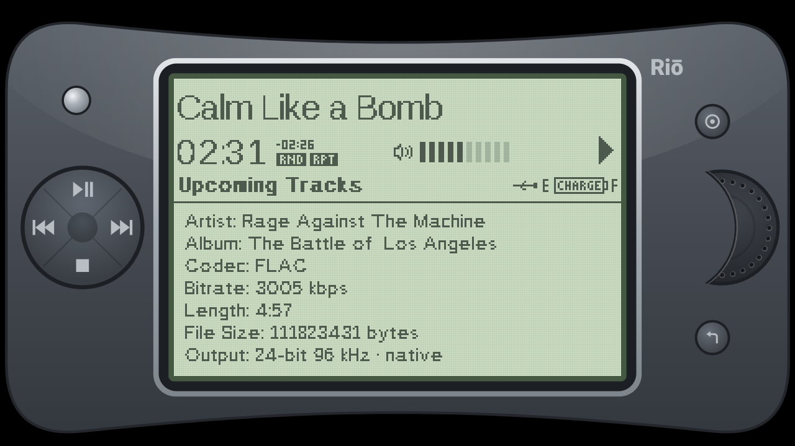
</p>

**MikuPod** (`com.miku.wheel`) has four click-wheel era skins, 2001, 2004, 2005 and 2007. Each one
is a pixel-scaled panel at the top of the screen with a touch wheel below it. The research is in
[docs/research/clickwheel-era-research.md](docs/research/clickwheel-era-research.md). It has
haptics the originals never had, and a radio screen that drives the FM app the same way Riot mode
does.

Both use pulse lengths measured on this motor, see
[docs/research/m500-haptics.md](docs/research/m500-haptics.md).

<p align="center">
  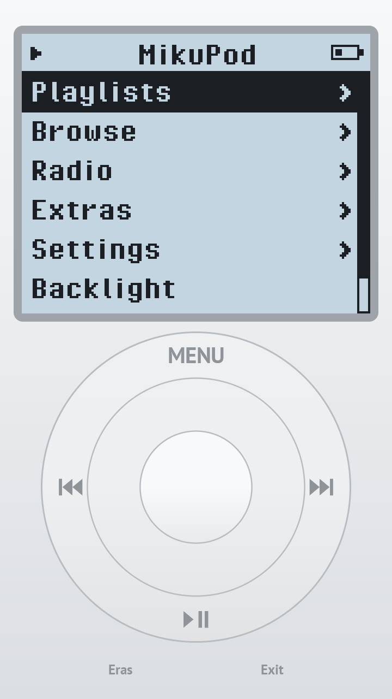
  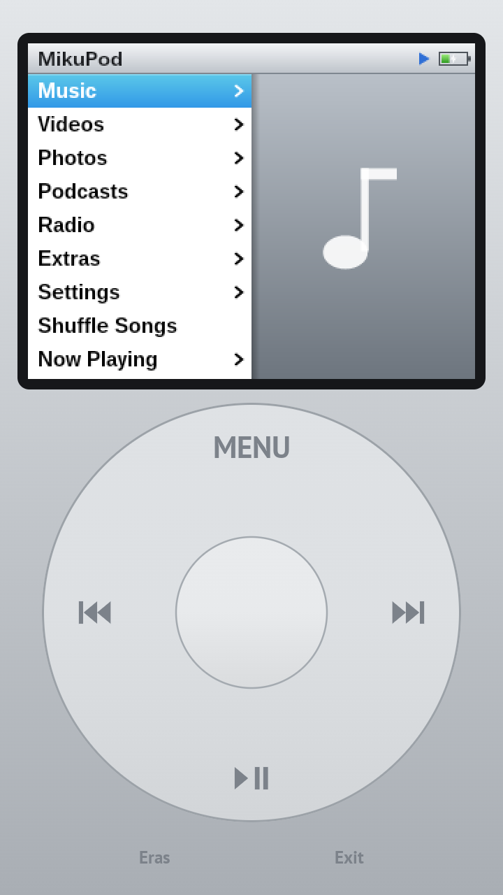
  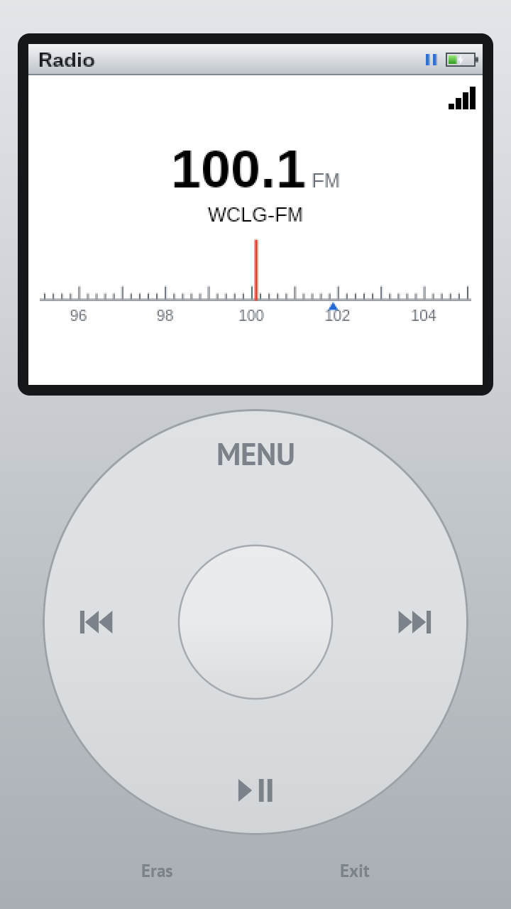
</p>

---

## The poor man's ambient light sensor

The M500 has no ambient light sensor. There is no ALS in the hardware, nothing under
`/sys/class/sensors`, and `SensorManager.getDefaultSensor(TYPE_LIGHT)` returns null. Stock firmware
has no auto-brightness for that reason, which is a real problem on a device you use outdoors: walk
into direct sun with the screen on an indoor level and it is too dim to read well enough to find the
brightness slider.

So MikuOS measures the light with the only light-sensitive part the device actually has. The camera.

Auto-exposure is a light meter. Point a camera at a scene, let it settle, and ask it what exposure it
chose. That answer is a measurement of how bright the room is. `com.m500.hardware` opens the camera
at the smallest resolution it supports, waits for AE to converge, reads back the exposure time, ISO
and aperture, and converts them to an EV and then to approximate lux. It samples on a long interval
and only when the screen is on, because a camera left running is a battery and a privacy problem.

It is an inference from a real measurement, not a guess. The reading and its confidence are both
shown, and when AE has not converged it says so instead of printing a number.

---

## Making it fast

The player opened in about 30 seconds and scrolled badly. Fixing it turned up one finding that
dwarfed the rest.

**Install release builds, not debug.** On this SoC the debuggable build costs more than
every app-level optimization put together: JIT only, no AOT, lock verification on, no R8. Same code,
same device, release instead of debug took launch from 5,692ms to 1,029ms and scrolling from 82%
janky frames to 8%, P50 from 69 to 117ms down to 32ms.

Four app-level fixes mattered on top of that:

1. The library cache was loaded on the main thread inside a `remember{}` block, which was 7 to 10
   seconds of the launch. It now loads from IO, and library work runs on a small background pool so
   it cannot starve the UI thread.
2. The navigation accessibility service declared `canRetrieveWindowContent=true` with `typeAllMask`,
   so every Compose app in the OS walked its full semantics tree on every layout pass. That was 43%
   of the main thread. The service now declares no content retrieval and four event types, and apps
   clear their semantics at the root when the only enabled service is ours.
3. Backdrop blur over the whole content area drew the list twice and blurred it every frame. It is
   gated off by default.
4. Liked hearts in list rows each ran their own 60Hz animation loop. Only the large ones animate now.

**ART will not JIT a method over 16,384 dex instructions.** It never compiles and runs interpreted
forever. Compose composables cross that line more easily than you would think: the lockscreen was
18,785 and the network observatory was 46,419. `tools/scan_jit_limit.sh` fails the build on it.

**Screen-off CPU.** The player's idle controller was checking a flag that did not track the real
display state, which cost 67% of a core with the screen off. The launcher was capturing audio FFT
for a BPM badge nobody could see. Measure this with per-thread `/proc` deltas against zero rendered
frames.

**The FM spectrum.** Folded into the radio's main state, the spectrum recomposed the whole FM screen
25 times a second and 42% of frames were janky. It has its own flow now.

---

## Building an image

You need the stock M500 firmware. It is not in this repo and it is not ours to distribute.

```bash
# 1. Put the extracted stock firmware here
#    m500-system-archive/firmware/extracted_1.00/{boot,init_boot,dtbo,vendor_boot,super}.img
#    (the folder says 1.00, the firmware in it is 1.20, see "What we keep from HiBy")

# 2. Optional: HiBy's 1.30 builds of cs43198_dlkm.ko, cw2015_battery.ko and the health HAL,
#    taken from HiBy's 1.20 to 1.30 OTA, in m500-system-archive/firmware/hiby_1.30_parts/
#    (or point HIBY130_DIR at them). Without them the build patches the 1.20 DAC driver for
#    NOS and leaves the fuel gauge and health HAL stock.

# 3. Bring your own platform key set (see Signing and keys). The generator is not
#    published: generating keys is four openssl calls and shipping a script that
#    writes signing keys into a fixed path invites people to reuse someone else's.

# 4. Build the super image
./os/build_mikuos_super.sh
```

`build_mikuos_super.sh` unpacks super, resizes the partitions, re-keys the framework and apps to
your platform key, patches the FM driver and `services.jar`, swaps in the HiBy 1.30 parts if you
have them, injects the MikuOS apps and configs, and repacks. It produces
`mikuos/out/mikuos_system_bundle.img`, about 5GB.

Switches, all on by default unless noted: `MIKU_FM_UNLOCK` and `MIKU_FM_STEREO` (the FM band and
stereo blend parts of the driver patch), `MIKUOS_ANDROID_AUTO`, and `MIKU_NO_REPLACEMENTS=1` (off by
default) to keep the stock Clock, Calculator, Calendar, Camera, Gallery and Recorder.
`MIKUOS_VERSION` defaults to 0.3.0.

**Bump `MIKUOS_VERSION` on any change to a system app.** It becomes part of the build fingerprint,
and PackageManager only re-reads the system apps' manifests when the fingerprint changes. Rebuild
with the same version and keep `/data`, and the new APK's code runs with the old manifest. A new
permission in the FM app was in the APK on the device and never granted, through two reboots,
because of exactly this.

**Order matters and the script is the documentation.** Stock images use ext4 `shared_blocks`. You
MUST `resize2fs` first, then `e2fsck -E unshare_blocks`, then write with debugfs. Unshare on a full
filesystem fails with "Could not allocate block", leaves the filesystem still marked with errors,
and every subsequent debugfs write then corrupts a neighboring file. A build that boots to a hung
splash is almost always this, not app code.

**Re-sign SystemUI to the platform key.** A Falcon-signed `com.android.systemui` against a
`REKEY=0` image crash-loops several hundred times and takes navigation, transitions and the tuner
down with it. That single mismatch was behind a long run of builds that looked cursed for no
apparent reason. The build re-signs it and gates on it before the image is written.

**Privileged apps are checked before they go in.** `os/check_privapp.py` fails the build if
MikuSettings asks for a privileged permission the allowlist does not grant. On this device that
would be a bootloop, not a warning.

---

## Flashing

This can brick your device. Read the whole section.

**Use `fastboot -w`, never `fastboot erase userdata`.** Erasing leaves userdata raw and the device
bootloops. Metadata holds the FBE keys, so erasing it without erasing userdata gives you an
undecryptable partition.

**Super needs 64MB chunks.** `fastboot -S 64M flash super`. Larger chunks wedge the M500's USB
gadget partway through a 5GB transfer. Never run two fastboot processes at once. Flash the boot
class and super as separate invocations.

**A wedged gadget needs a physical power cycle.** Once fastboot goes D-state and transfers 0 bytes,
no amount of retrying or re-plugging fixes it. Pull the cable, hold power, start over.

**Fastboot does not charge the battery.** A device reading 0mV in fastboot is not dying, it is not
being told. Do not flash on a low battery.

**An interrupted flash corrupts super.** There is no pstore on this device, so there is no crash log
waiting for you afterward either.

**On a fresh /data, expect two things that are not bugs in MikuOS.** GMS loses its SafetyCenter
privileged permission and trips RescueParty into a boot loop, and an app in the stopped state has no
quick settings tiles until it is launched once.

---

## Signing and keys

MikuOS replaces the public AOSP test keys, which every Android developer on earth already has, with
a key set you generate. That is the entire security model, so it is worth being precise about it.

Four key roles, matching AOSP: `platform`, `releasekey`, `media`, `shared`. The framework, the system
apps and our apps are all re-signed to your `platform` key, which is why our apps get platform
permissions without root. Generate them once, back them up somewhere that is not the build machine,
and never commit them. The `.gitignore` in this repo is written to make committing them difficult on
purpose.

The over-the-air manifests are signed with a separate pair of P-521 keys, see
[Updates over the air](#updates-over-the-air).

Three things that will cost you a day if you do not know them:

**Re-signing strips the SELinux label.** An unlabeled `/system` app cannot be read by its own process
and init will not process an unlabeled `.rc` file. Every injected file needs its `security.selinux`
extended attribute set afterwards, and the build script does that with `debugfs ea_set`.

**Do not re-key NetworkStack.** Splitting `android.uid.networkstack` across an APEX boundary is fatal
to Android 14's package manager, and the failure looks like a boot hang rather than anything
informative. `REKEY_ROLES` excludes it.

**APEX modules can be re-signed**, including the compressed `.capex` form. That is proven on
`com.android.mediaprovider`. The thing that actually breaks media when you get it wrong is the
`mac_permissions` pin, not a UID split.

---

## Hard-won platform facts

Things this project had to find out the expensive way, written down so nobody has to find them twice.

| Fact | Why it matters |
|---|---|
| `debugfs write` silently no-ops on a file that already exists | Every build.prop edit "succeeded" and none of them applied. Delete first, then write |
| `debugfs` also no-ops on a full filesystem, producing zero-block inodes | A full image looks like a successful build and boots to nothing |
| ART refuses to JIT a method over 16384 dex instructions | Compose composables cross it easily and then run interpreted forever. `tools/scan_jit_limit.sh` catches it |
| Reading animated state in a composable's body recomposes it every frame | 39% janky frames on the shade until the reads moved into layout and draw lambdas |
| Object-scope Compose state is main-thread-write-only | A `mutableStateMapOf` written from an IO thread crash-looped the app |
| A force-stopped package is dropped from `enabled_accessibility_services` | `am force-stop com.miku.systemui` kills the device's navigation until you re-enable it by hand |
| Android promotes an AudioTrack to `FLAG_DEEP_BUFFER` at about 100ms | Which silently opts you out of DIRECT output. This is the whole bit-perfect problem |
| `VOLUME_CHANGED_ACTION` fires for every stream | And a `Settings.System` observer fires for every setting, which made a volume HUD pop up at random |
| Never start work from the broadcast that says that work finished | Answering `ACTION_MEDIA_SCANNER_FINISHED` with another scan is an endless loop |
| A symlinked native dependency is invisible to Gradle's up-to-date check | libprojectM shipped a stale `.so` until `app/.cxx` was wiped |
| SELinux keys the FM tuner HAL on the package name, not the signature | Platform-signing does not buy access to `/dev/radio0`. Only repackaging does |
| Installing an app kills its own playback | `installPackageLI` stops the player, so do not deploy while someone is listening |
| A `.gitignore` of `*` hides untracked files from `git status` | Nothing ever prompts for them. The TV companion and three launcher files each sat unrecorded for days. Only force-adding by name finds them |
| The DAC's sysfs nodes are denied even to a root-less `adb shell` | So there is no read-back from an app. `AudioManager.setParameters` does not reach them either, since the vendor audio HAL has no HiBy keys at all, and a `su` echo was always a no-op. Only init writes them, which is why MikuOS goes through the system bridge and a vendor `.rc` |
| HiBy restores the DAC settings at boot only when `Build.MODEL` is M500 or M500_MIKU | Rename the model, as MikuOS does, and the DAC runs on driver defaults with no error anywhere |
| Only 4 of the 31 `sa_sound_setting` nodes change hardware on the M500 | The rest accept a value and do nothing. Never write `dac_type`: its store returns 0 bytes written and the writer loops |
| HiBy 1.20's `NotificationManagerService.playSound()` returns `false` | No notification on 1.20 ever made a sound. 1.30 put the AOSP body back |
| HiBy 1.30 adds `IAudioService.setProperties()` with no permission check | Any app can set any property system_server may set. MikuOS stays on the 1.20 framework and patches the one method it needs instead |
| The firmware archive's "v1.00" is firmware 1.20, and its "v1.20" is the 1.20 to 1.30 OTA | Read `ro.fota.version` in the image, not the label on the file |
| Android resets `android:priority` above 0 to 0 for apps outside priv-app | Stock Settings' priority-1 filters beat MikuSettings and put a chooser on every tie, until MikuSettings moved to priv-app |
| `ro.control_privapp_permissions=enforce` makes no exception for platform-signed apps | One privileged permission missing from the allowlist stops system_server at boot. `os/check_privapp.py` turns that into a build failure |
| PackageManager only re-reads system app manifests when the build fingerprint changes | Same `MIKUOS_VERSION`, kept `/data`: new code, old manifest, and a new permission that never gets granted |
| Android Auto refuses to run unless it is a privileged system app | And it has to keep Google's signature, so the splits go in exactly as signed. Merging them re-signs the APK and breaks the GMS check |
| The FM app's SELinux domain cannot open network sockets | Song ID, alerts and logo fetches go through the system bridge, which forwards them for a fixed list of hosts |
| The Si4705 tunes 64 to 108 MHz | NOAA Weather Radio at 162 MHz is out of its range. The weather list in Miku FM is reference only |
| `handle_fm` is an output-device bitmask, not a boolean | `handle_fm=1` has `AUDIO_DEVICE_OUT_FM` clear, so it tells the audio HAL to **stop** FM. The tuner tuned, locked RDS and reported stereo for a day while the HAL was being asked to shut the session down |
| The FM driver comes up muted and `setMuteMode()` does not clear it | That mute is in HiBy's V4L2 layer, not the FM core. `FmReceiverJNI.setV4L2RadioFmMute(0)` is the one that opens the audio |
| `FmReceiver.setStation()` returns true and tunes nothing on this board | Stock tunes with `FmReceiverJNI.setV4L2RadioFrequency(kHz * 16)` and fakes the tune callback itself. The HCI call reports success while the V4L2 read-back still shows the bottom of the band |
| The M500 has **two** FM paths, and `/dev/radio0` is the Si4705 | `/sys/class/video4linux/radio0/device` resolves to `i2c-2/2-0063`. The Qualcomm WCN FM stack answers too, but `getSocName()` returning `cherokee` is the **Bluetooth** SoC name out of `bt_configstore`, not the tuner |
| The `RADIO_TUNER` capture is not always the tuner audio on wired output | On 0.1.15 the HAL opened it as usecase 20 `audio-record` with no FM calibration (`ACDB: No calibration found`). Captures at the strongest and deadest frequency were indistinguishable and ignored every mute, while RSSI moved 0 to 19. On 0.3.0 on 4.4mm it carried the radio audio and song ID matched. Test it before you plot it |
| `FmReceiver` will not re-enable on the same object after a `disable()` | `FmTransceiver` wants its state machine back at Turned_Off and does not reliably get there, so the second power-on returns false. Build a fresh receiver per power cycle |
| There is no FM transmit API on this device | `FmReceiverJNI` has a `setTxPowerLevelNative`, but `qcom.fmradio.jar` ships no `FmTransmitter` class to reach it. Both FM paths are receive-only |
| The M500's bootloader reports `product: khaje` and `partition-size:super: 0x1402A0000` | 5371461632 bytes. Both are the guard rails the web installer refuses to flash without, and both were re-read off the device on 2026-10-09 |
| Only one of the two FM paths has an antenna | Swept together on 2026-10-09: the Si4705 reads RSSI 19 / 12 / 9 / 3 / 2 at 88.3 / 91.2 / 97.8 / 103.8 / 107.9 MHz, the Qualcomm core reads **0 at every one of them**, SINR 0. The Qualcomm FM core answers commands and receives nothing, so there is no second usable tuner |
| HiBy's Si4705 driver exposes `radio_switch`, `radio_freq`, `radio_seek_start`, `radio_info` | And denies all four even to the platform-signed app in the `vendor_fm_app` domain, not just to `adb shell`. They are not a usable control surface from userspace |
| Stock FM2 will not start on a re-keyed image | `isAntennaAvailable() = mInternalAntennaAvailable \|\| mHeadsetPlugged` comes back false and it never calls `FmReceiver.enable` at all. `ro.vendor.fm.internal_antenna` is unset in HiBy's own firmware too, and the app is SELinux-denied from reading it. Stock is not available as a working reference here |
| The Si4705 starts at `DIGITAL_OUTPUT_FORMAT 0x0006`, which is **24-bit mono** | And PAL reads that backend as 48000/16-bit/2ch, so without a `VIDIOC_S_TUNER` the chip feeds misaligned samples into the loopback. That is not quiet audio, it is white noise, and it happens while the tuner locks, RSSI tracks the antenna and the HAL reports a healthy session. Stock calls `setV4L2RadioChannelMode` right after enable and re-issues the frequency behind it |
| `setV4L2RadioFmVolume` **attenuates** this part, it does not boost it | The driver registers `V4L2_CID_AUDIO_VOLUME` with range 0..15 against a chip whose `RX_VOLUME` default is 63, so the v4l2 core clamps the write and costs you about 12 dB. Stock never touches that control at all |
| `FmReceiver.setStereoMode()` does not reach the tuner that carries the audio | It is the WCN core's blend setting. The Si4705's stereo/mono **is** its digital output format, so stereo has to be set through V4L2 or the switch changes nothing you can hear |
| Stock's `fm_volume` is not a constant | It is `10^(dB/20)` of `getStreamVolumeDb(STREAM_MUSIC, index, device)`, so it tracks the media index and reaches 1.0 at full volume. The often-quoted 0.052481 is just where one capture's volume happened to sit |
| The FM driver comes up **unmuted**, it is the V4L2 control cache that starts muted | `RX_HARD_MUTE` is never written at start and the driver never runs `v4l2_ctrl_handler_setup`, so `getV4L2RadioFmMute()` reads 1 while audio is flowing |
| Two different stock FM2 builds exist, and the pre-decompiled one is not the one on the image | The image APK's `isAntennaAvailable()` is `return true`. The later build gates on `getInternalAntenna()` and adds the A2DP `AudioRecord` bridge. Check which dex you are reading before concluding anything about "what stock does" |
| A background process gets an **empty** Wi-Fi scan list, not an error | Without `ACCESS_BACKGROUND_LOCATION` an always-alive daemon reads zero access points while seven are in range, and the BSSID comes back `02:00:00:00:00:00`. Indistinguishable from a device with no Wi-Fi, and it silently cost the fused position an entire image |
| This vendor's Wi-Fi stack stops scanning once it is associated | Measured 2026-10-09: seven APs in range, newest scan 38 minutes old, `startScan()` refused, `wifi_scan_always_enabled=0`, and `cmd wifi start-scan` from a shell changed nothing. Any age filter on scan results therefore discards everything there is |
| Passive location updates alone can never produce a first fix | They only report fixes some other app paid for, and nothing else on this device asks. Wi-Fi cannot break the deadlock either, having never learned where any AP is. One self-removing single-shot request is enough, and is not the same cost as holding GNSS open |
| The FM sepolicy grants `open` but not `getattr` on `/dev/radio0` | So `File.exists()` returns false for a node that is present, mode 0666 and opens fine, and anything that stats before reading concludes the device is missing. `android.system.Os.open`/`Os.read` are bare syscalls and work |
| The tuner's audible gain is `fm_volume=0.052481`, and it is easy to overshoot | That is what stock FM2 sends and the only value this device has been measured audible at. A tuner level picked off a taper curve instead sent 0.331, 16 dB hotter, with the Si4705 simultaneously driven to full scale. Louder is not better here |
| A blanket `**/build/` in `.gitignore` also swallows hand-written build scripts | `mikuos/build/` is not Gradle output. The image build script had no history in the internal repo at all, only the renamed copy published here |
| FM reaches the DAC through an ADSP loopback on every output but Bluetooth | So the `AudioRecord`-to-`AudioTrack` bridge is A2DP-only. Running it as well is not louder, it is an echo one capture buffer behind |
| HiBy's Si4705 driver copies **four** bytes of each RDS group to userspace | `si4705_fops_read` fetches all four blocks with `FM_RDS_STATUS` and hands back only A and B. C and D carry every character of the station name and RadioText, so no app could ever show them. `os/patch_si4705_rds.py` changes the copy length to eight (hash-checked against the stock module) |
| RDS reception is only switched on from `poll()` | `si4705_fops_poll` writes `FM_RDS_CONFIG=0xFF01` when a caller polls for input while the chip is out of sync. Nothing else enables it, and stock FM2 never polls. Also, `read()` returns 0 whether or not it copied a group, so detect new data by what changed in the buffer |
| The driver reads the stereo pilot and throws it away | `si4705_vidioc_g_tuner` reads `FM_RSQ_STATUS` but never `RESP3` (pilot and blend), and never fills `rxsubchans`. The same patch puts `pilot << 3 \| blend / 16` where the vendor JNI already exposes four bits (`getV4L2RadioFmSignal()[6]`) |
| The Si4705 driver has no locking | A signal poll, an RDS read and the HCI callback thread at the same time tore the chip's command and response pairs apart, and every second signal reading came back all zeros. Miku FM puts one lock around every call to `/dev/radio0` |
| The "mono" and "no RDS" callbacks come from the tuner with no antenna | `FmRxEvStereoStatus` and `FmRxEvRdsLockStatus` belong to the Qualcomm WCN core. They report mono and no RDS whatever the Si4705 is receiving |
| A stereo FM signal needs about 49 dBµV on the Si4705 | It blends to mono below that, and indoors on the headphone-cable antenna 10-20 is typical. Mono there is physics, not a bug |
| The "dual output" vendor parameters do not exist | `vendor.audio.dual_output`, `bt_dual_stream` and `usb_mirror` appear nowhere in the audio HAL or its configs. Android routes a stream to one device, so playing to several means the player writing one `AudioTrack` per device |
| Android keeps a separate music volume per output | The volume keys move only the device the policy currently routes music to. Plug in a USB headset and the keys drive it, while a 4.4mm pair the player pinned stays wherever it was last left |

---

## Repo structure

| Path | What it is |
|---|---|
| `app/` | Miku Music, the player. Also published standalone as [MikuMusic](https://github.com/sworrl/MikuMusic) |
| `mikuos-launcher/` | The launcher: home, weather, ingest observatory, network observatory, WireGuard, the BPM game |
| `mikuos-systemui/` | The replacement SystemUI. On this device the accessibility service *is* the navigation |
| `mikuos-settings/` | The settings app, its search indexables provider, and the router for every stock Settings intent |
| `hardware-settings/` | Audio hardware control, QS tiles, the Fn lock daemon, ambient brightness |
| `miku-sysbridge/` | The system bridge, the one MikuOS app that runs as the system UID |
| `fmradio/`, `qcom-fmradio-stubs/` | The FM tuner app (`com.caf.fmradio`) and the QCOM HAL stubs it builds against. It has to be bundled in the image to reach the tuner, see [What is verified](#what-is-verified) |
| `mikuos-tools/` | Clock, Calculator, Calendar |
| `mikuos-media/` | Camera, Gallery, Recorder |
| `mikuos-update/` | Miku Update, the over-the-air app updater |
| `mikuos-riot/`, `mikuos-wheel/` | Riot mode and MikuPod |
| `voicecheck/` | Voice Check, for reviewing voice clips on the device. Not in the image |
| `os/` | Build and flash scripts. `build_mikuos_super.sh` is the main event, `flash_mikuos*.sh` are the delivery paths. Also the build's patches and checks: `patch_si4705_rds.py` (FM driver), `patch_cs43198_nos.py` (NOS fallback for 1.20), `adopt_hiby130.py` (HiBy 1.30 parts), `patch_services_notif_sound.py` (notification sound), `check_privapp.py` (privileged permission gate), and `permissions/` |
| `docs/` | The reverse-engineering reference, audio architecture, PKI design, security review, roadmaps, screenshots |
| `docs/research/` | Write-ups behind the 0.2.0 and 0.3.0 work: the NOS filter, the DAC knobs, HiBy's firmware history and the 1.30 diff, Settings parity, the splash inventory, Rio Riot and click-wheel research, the M500's haptics |
| `ota/` | Over-the-air: public keys, the publisher, the manifest format |
| `art/` | Boot video and splash art, with the prompts that made them |
| `data/` | Rendered voice clips and sound effects |
| `tools/` | Signing helpers, the JIT scanner, the preset generator, sync tooling, the RROs under `custom_overlays/` (including `MikuSplashOverlay`), the entitlement Worker, the remote PWA |
| `tools/voice/` | The voice and sound effect pipeline |
| `tools/radiodb/` | Builds the FM station catalog and the NOAA transmitter list |
| `tools/profiles/` | Builds Miku Music's listening profiles from AutoEq |
| `tools/androidauto/` | Generates the Android Auto privileged permission allowlist |
| `assets/` | Artwork. See [Legal](#legal) about what is in here |

Everything above builds from one Gradle tree (`settings.gradle.kts`). The apps are
platform-signed with the Falcon Technix key, which is what replaces the AOSP public test keys and
is why MikuOS needs no root. See
[the signing and PKI design](docs/09_mikuos_signing_and_pki_architecture.md).

## The device

HiBy Digital M500 x Hatsune Miku edition, fastboot product `khaje`. Qualcomm SM6225 `bengal`
(Snapdragon 680), six cores, Android 14 base `UKQ1.241213.001`, kernel
`5.15.153-android13-8`, security patch 2025-09-03,
3.2 inch 720x1280 portrait panel at 270dpi. Dual Cirrus Logic CS43198 in the "MIKU DAC"
configuration, 3.5mm single ended and 4.4mm balanced, plus USB DAC output. Physical power, volume
wheel, play/pause, next, previous and Fn on the right edge. Si4705 FM tuner, using the headphone
cable as its antenna. An accelerometer and a magnetometer, one rear camera. No ambient light
sensor, no gyroscope, barometer, proximity sensor, NFC or front camera, and no pstore.
Stock kernel 5.15.153 is the one to stay on, see the 5.15.209 row in
[What is verified](#what-is-verified).

HiBy drives the DAC settings (digital filter, DRE, gain, high-power mode) through init triggers on
`vendor.audio.hiby.*` properties. MikuOS uses its own `persist.vendor.audio.miku.*` triggers, see
[DAC settings and the NOS filter](#dac-settings-and-the-nos-filter). The Pulsar LED runs off the
same kind of vendor property, see [System UI](#system-ui).

**Mobile data, if you have a data-only Google Fi SIM.** Install the Google Fi app, run its
activation most of the way and pick "move number later" when it asks about a number, then ignore it.
It can be uninstalled afterward. Reboot and data attaches. Do not port a number in, because that
converts a data-only SIM to a full plan. The APN is baked into the image.

---

## What we keep from HiBy and what we replace

MikuOS is not built from AOSP source. It is HiBy's own Android 14 for this device with the parts we
care about taken out and rebuilt, so most of what runs on the M500 is still theirs.

**MikuOS is built on HiBy's WiFi firmware 1.20** (`ro.fota.version=1.20_20260228-1619`, build
`eng.HiBy.20260228.173244`). The firmware archive this project started from labels that package
"v1.00" and labels the 1.20 to 1.30 incremental "v1.20". Both labels are wrong, and the images say
what they really are. The 1.30 OTA was applied locally and every one of its 14 partitions matched
HiBy's own hashes, so 1.30 could be compared file by file. HiBy has since released 1.40 and 1.41.
No image of either has been obtained, so those have not been examined.

HiBy's changelogs mostly say "fixed several other bugs".
[docs/research/hiby-firmware-history.md](docs/research/hiby-firmware-history.md) lists what those
bugs actually were, release by release, and what each one means for MikuOS. The short version for
1.30: the NOS mask, the balanced DAC writes, the fuel gauge, a charger race in the health HAL,
notification sounds, headset buttons, the speaker and headphone paths. The Si4705 driver was not
touched. [docs/research/hiby-1.41-diff.md](docs/research/hiby-1.41-diff.md) is the module-level
diff.

### Unchanged, and deliberately so

| Part | Why it stays |
|---|---|
| `vendor`, `vendor_boot`, `vendor_dlkm`, `odm`, `dtbo` | Qualcomm's and Cirrus Logic's audio HAL and DSP live here. This is the part that makes the M500 sound the way it does. It stays stock except for the files listed under Replaced |
| Kernel `5.15.153-android13-8` (GKI) | Stock 1.20. 5.15.209 was tried and disqualified: `mp2731` never qualifies the charger input, so the device drains on the cable. The 1.30 modules MikuOS takes are checked against this kernel's symbol CRCs |
| The bootloader | Not modified. Unlocking is the user's own step |
| Android 14 `UKQ1.241213.001` framework | Re-signed to your key, not replaced. The AOSP behavior underneath is stock, apart from the one `services.jar` method patched for notification sounds |
| HiBy's framework hooks | Several of them are load-bearing for us: `Settings.Global button_lock` is what makes the root-free Fn pocket lock work, and `hiby_volume_dialog_enable` gates their volume HUD |

### Replaced

| Part | Stock | MikuOS |
|---|---|---|
| Signing keys | Public AOSP test keys, which every Android developer already has | A platform key set you generate. This is the whole security model |
| Player | HiBy Music | Miku Music, a native Kotlin and Compose app |
| Home screen | HiBy's launcher, not properly replaceable | `com.miku.launcher` |
| System UI | Stock | `com.miku.systemui`, including gesture navigation as an accessibility service |
| Settings | Stock plus HiBy's | `com.miku.settings` as a priv-app, and `com.m500.hardware`. Stock Settings stays in the image, hidden |
| DAC settings | Applied at boot by a HiBy service that skips any model not named M500 | The system bridge and `miku_audio.rc` |
| DAC driver | 1.20 `cs43198_dlkm.ko`: NOS bit masked off, balanced DAC written only in balanced mode | HiBy's 1.30 build, or a four-byte NOS patch to 1.20 if you only have 1.20 |
| FM driver | `radio-si4705-common.ko` copies half of each RDS group, drops the stereo pilot, clamps the band | Patched in place, hash-checked |
| FM app | HiBy's FM2 | Miku FM, same package name |
| Fuel gauge and health HAL | 1.20 builds | HiBy's 1.30 builds |
| Notification sound | Stubbed out in 1.20's `services.jar` | The AOSP method body put back |
| Charge limit | None in 1.20 (HiBy added one in 1.40) | Off, 80, 85 or 90% |
| Clock, Calculator, Calendar, Camera, Gallery, Recorder | AOSP, Qualcomm and HiBy apps | MikuTools and MikuMedia |
| Boot video and popups | HiBy's logo and the official Miku logos | MikuOS art |
| Android Auto | Not included | Bundled, Google-signed |
| Audio path | Mixed and resampled through Android's mixer, so a 44.1kHz file does not reach the DACs at 44.1kHz | DIRECT output at the file's native rate, 24-bit packed |
| Root | Magisk, in every previous attempt at this | None. Platform-signed apps hold the permissions outright |
| Pulsar LED | Vendor init pins `led_pattern 1` and nothing updates it once HiBy Music is gone, so it sits solid blue | `miku_led.rc` in vendor turns the standby glow off |
| Auto-brightness | None, because there is no ambient light sensor | The camera used as a light meter |
| APN | No Google Fi entry | `h2g2` baked in for 310240 and 310260 |

### What this means if you are deciding whether to flash

You keep HiBy's audio hardware, DSP and drivers. The drivers MikuOS changes are HiBy's own 1.30
builds or small patches that refuse to apply to anything but the exact stock file. You lose HiBy's
apps and their OTA updates, since a MikuOS image will not accept HiBy's delta packages. Going back
means flashing HiBy's stock firmware, which you should keep a copy of before you start.

---

## Known limitations

- **One device.** Everything here is verified on an M500 and nothing else.
- **Part of 0.3.0 is not yet tested on hardware.** See [What is verified](#what-is-verified).
- **FM needs a decent signal for stereo and RDS.** The antenna is the headphone cable. Indoors in a
  valley it locks and plays in mono with no station data, and that is the radio telling the truth.
  RDS shows up on a strong station.
- **FM is one output at a time.** It runs through an ADSP loopback to a single device, so playing
  to every output at once covers Miku Music, not the radio.
- **FM song ID and the spectrum need a capture of the radio audio.** On 0.3.0 it worked on the
  4.4mm output. On 0.1.15 it came back silent on wired outputs, so the app tests it first and backs
  off when it is silent.
- **No weather radio.** NOAA Weather Radio is at 162 MHz and the tuner stops at 108. The list in
  Miku FM is reference only.
- **Per-output volume while sharing is not confirmed on hardware.** The sliders are built. Whether
  the device grants the permission they need has not been checked.
- **The charge limit is a hold, not a stop.** The charger has no off switch, so the level may drift
  while it is held.
- **System updates still need a PC.** Miku Update only updates the MikuOS apps, and never the FM app.
- **Stock Settings is still in the image**, hidden, until MikuSettings rebuilds the last flows it hosts.
- **HiBy firmware 1.40 and 1.41 have not been examined.** No image of either has been obtained.
- **No AOSP-from-source build yet.** The device tree exists, the sync is unfinished.
- **The web installer's `EXPECTED_PRODUCTS` list** still needs confirming against a real
  `fastboot getvar product` before anyone should trust it to refuse the wrong device.
- **Stock firmware is not included** and will not be. Bring your own.
- **Some artwork in this repo is not ours.** See [Legal](#legal).

---

## Contributing

**This is a work in progress and help is genuinely welcome.** Open an issue or a pull request.

What would help most, roughly in order:

- **Another M500.** Everything here is verified on exactly one device, which is the single biggest
  limit on the project.
- **An LDAC sink**, so the Bluetooth codec path can be proven or disproven instead of sitting at
  "implemented, unverified".
- **A NOS listening test**, or better, a way to read the filter register back on hardware.
- **FM listening reports from somewhere with a clear line to a transmitter**, to confirm stereo
  on the patched driver and how the reception estimates hold up.
- **A car with Android Auto**, to find out whether audio reaches it over a wired connection.
- **Testing the web installer against a second device**, including a real `fastboot getvar product`.
- **HiBy firmware 1.40 or 1.41 images**, so the firmware history can be carried forward.
- **Original artwork, drawn by a person.** Most of the Miku art in here came out of an image model,
  and the rest came off the stock device. Neither belongs in the finished thing. Wallpapers at
  720x1280, a square album-art placeholder, a themed launcher icon set, lockscreen and AOD art, and
  boot splash art are all wanted. You keep your copyright and you can have it pulled at any time.
  Terms and the full list are in
  [ATTRIBUTIONS.md section 7](ATTRIBUTIONS.md#7-we-are-looking-for-real-art).
- **Anywhere a number on screen is not measured.** A report of one is as useful as a patch.

One house rule, and it is not negotiable: **never display a value you did not measure.** No
placeholder percentages, no bit depth inferred from a file extension, no BPM guessed from a title.
If the data is not there, show a dash and say why. Several passes of this codebase have been spent
removing exactly that kind of thing.

Beyond that: match the surrounding code, comment the WHY rather than the what, and if you work out
a non-obvious platform behavior, write down what the platform actually does so the next person does
not have to rediscover it.

---

## Legal

GPL-3.0-or-later for our code. See [LICENSE](LICENSE). A full component-by-component breakdown of
every font, library, vendored source tree and image in this project, with its license and its
origin, is in [ATTRIBUTIONS.md](ATTRIBUTIONS.md).

Hatsune Miku and the associated character designs are the property of Crypton Future Media. This is
an unaffiliated hobby project for a device Crypton licensed. It is not endorsed by Crypton or by
HiBy Digital.

**The artwork is the part that is not settled, and this section used to claim otherwise.** There are
two problems with it and both are written up in full in
[ATTRIBUTIONS.md section 3](ATTRIBUTIONS.md#3-artwork).

The first is that a lot of the Miku art here was generated by an image model rather than drawn by a
person. It is a derivative work of Crypton's character, it is non-commercial, and it is not the work
of any human artist. It is also not what this should ship with. There is an open ask for real art
under [section 7](ATTRIBUTIONS.md#7-we-are-looking-for-real-art), and it is a genuine ask. The new
boot video and popup art are image-model output too, so the same ask covers them.

The second is that some of the images came off a stock M500. Those are HiBy Digital's files
depicting Crypton's character, and there is no license here to redistribute either layer. Owning the
device covers the copy on the device. It does not cover handing copies to whoever clones the repo,
and gating our code to M500 hardware does not change that. The intended end state is that the build
pulls those assets from the stock firmware you already own and the repos ship only art we made.
Until that is done, the honest statement is that they are in here and they should not be. If you are
HiBy or Crypton and want something removed, open an issue or email github@falcontechnix.com and it
comes out.

HiBy Digital's firmware, bootloader and audio HAL are theirs and are not redistributed here, which
is also why there is no prebuilt image to download. The same goes for the HiBy 1.30 files the build
can use: you supply them from HiBy's own update. The build scripts expect you to supply your own
copy of the stock firmware you already own. Qualcomm and Google components are under their own
licenses. Android Auto is Google's, is not in this repo, and goes into the image exactly as Google
signed it. libprojectM and jaudiotagger are LGPL-2.1 and are used as libraries. fastboot.js is MIT
and ships with its own license and notice.

The voice clips are rendered from Kokoro-82M (Apache-2.0) and the sound effects are synthesized
from code. The FM station records are FCC public data. Station formats come from English Wikipedia
(CC BY-SA 4.0), and every row keeps the title of the article it came from. The NOAA transmitter list
is NWS public data. Listening-profile EQ comes from AutoEq (MIT), from the measurements named on
each profile. Riot mode and MikuPod are unaffiliated tributes. Rio and iPod are trademarks of their
owners.

Flashing a replacement OS onto a device can brick it. This one is used daily on the author's own
M500, which is a statement about one device and not a warranty about yours.
