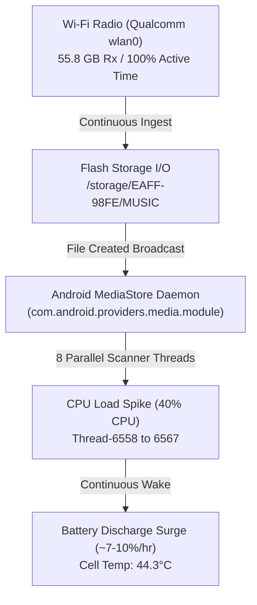

# HiBy M500 DAP (M500_MIKU_4G) Hardware & Sensors Audit Report

> **Device**: HiBy M500 Hatsune Miku Edition (`M500_MIKU_4G`)  
> **OS**: Android 14 (AOSP / QTI QSSI, Kernel 5.4, Build `UKQ1.241213.001 / eng.HiBy.20260615.192838`)  
> **SoC**: Qualcomm Snapdragon 680 4G (`SM6225` / `bengal`)  
> **Audit Date**: August 17, 2026

---

## 1. Executive Summary: Ambient Light Sensor & Hardware Verification

> [!IMPORTANT]
> **Ambient Light Sensor Status: NOT PRESENT (Hardware Absence Confirmed)**  
> The HiBy M500 DAP **does NOT have a physical ambient light sensor (ALS)** or proximity sensor.
> 
> * **Hardware HAL Audit**: The `dumpsys sensorservice` hardware sensor registry reports **22 active hardware sensors**, with `0` optical/photodiode lux sensors registered.
> * **Display Subsystem Verification**: The Android Display Service explicitly initializes `mLightSensor=null`, `mAmbientLux: -1.0`, and disables automatic adaptive brightness at the driver level (`autoBrightness=false`, manual PWM only).
> * **AOSP Feature Flag Discrepancy**: While `pm list features` shows `feature:android.hardware.sensor.light` due to standard Qualcomm BSP manifest defaults, no physical sensor chip is wired on the board.

---

## 2. Complete Sensor Inventory (22 Hardware HAL Sensors)

| Sensor Type | Driver / Vendor | Model / Handle | Function & Wakeup Behavior |
| :--- | :--- | :--- | :--- |
| **Accelerometer** | QST | `QMA6100` (`0x0b`) | 3-axis linear acceleration (1–200 Hz), non-wakeup |
| **Accelerometer (Wakeup)** | QST | `QMA6100` (`0x0c`) | 3-axis linear acceleration (1–200 Hz), wakeup |
| **Magnetometer / Compass** | QST | `QMC6309H` (`0x15`) | 3-axis geomagnetic field (1–100 Hz), non-wakeup |
| **Magnetometer (Wakeup)** | QST | `QMC6309H` (`0x16`) | 3-axis geomagnetic field (1–100 Hz), wakeup |
| **Magnetometer (Uncalibrated)** | QST | `QMC6309H` (`0x8d`, `0x8e`) | Raw magnetic vector + hard iron bias |
| **Significant Motion Detector** | Qualcomm | `sns_smd` (`0xac`) | Hardware interrupt on physical device movement |
| **Step Detector** | Qualcomm | `step_detect` (`0xb5`, `0xb6`) | Step impulse detector |
| **Pedometer / Step Counter** | Qualcomm | `pedometer` (`0xbf`, `0xc0`) | Continuous hardware step accumulator |
| **Geomagnetic Rotation Vector** | Qualcomm / AOSP | `sns_geomag_rv` (`0xc9`, `0xca`, `0x5f67656f`) | 6-axis gyro-less compass/accel orientation fusion |
| **Tilt Detector** | Qualcomm | `sns_tilt` (`0xde`) | Special-trigger gesture orientation tilt |
| **Device Orientation** | Qualcomm | `Device Orientation` (`0x10f`, `0x110`) | Portrait / Landscape hardware orientation |
| **Stationary Detector** | Qualcomm | `stationary_detect` (`0x123`, `0x124`) | Low-power sleep trigger when motionless |
| **Motion Detector** | Qualcomm | `motion_detect` (`0x12d`, `0x12e`) | Wakeup trigger upon pick-up |

> [!NOTE]
> **Absent Sensors**:
> * ❌ **Ambient Light Sensor (ALS)** (`android.sensor.light`): None.
> * ❌ **Proximity Sensor** (`android.sensor.proximity`): None.
> * ❌ **Hardware Gyroscope** (`android.sensor.gyroscope`): None (emulated via 6-axis `sns_geomag_rv` accelerometer/magnetometer fusion).
> * ❌ **Barometer / Pressure** (`android.sensor.barometer`): None.

---

## 3. SoC, Memory & Storage Architecture

* **SoC**: Qualcomm Snapdragon 680 (`SM6225` / `bengal`, 6nm TSMC)
  * **CPU Cores (8x ARMv8-A)**:
    * **4x Performance Cores**: Kryo 265 Gold (ARM Cortex-A73) clocked up to **2.40 GHz** (`0xd09`)
    * **4x Efficiency Cores**: Kryo 265 Silver (ARM Cortex-A53) clocked up to **1.90 GHz** (`0x801`)
  * **GPU**: Qualcomm Adreno 610 (Vulkan 1.1, OpenGL ES 3.2)
  * **DSP**: Hexagon 686 DSP with HVX
* **RAM**: 4.0 GB LPDDR4x (Total: `3,745,084 kB`, Available: `2,092,420 kB`)
* **Storage**:
  * Internal: 64 GB / 128 GB UFS/eMMC
  * External MicroSD: Mounted at `/storage/EAFF-98FE/` (750 GB Sandisk/Samsung card formatted FAT32/exFAT)

---

## 4. Display Subsystem

* **Panel Resolution**: 720 x 1280 (HD 16:9 vertical format)
* **Density**: 320 DPI (`xhdpi`)
* **Refresh Rate**: 60.0 Hz
* **Backlight Control**: Direct hardware PWM (`/sys/class/backlight`), manual brightness range `0.0` to `1.0`. Auto-brightness controller is permanently disabled (`strategy=InvalidBrightnessStrategy`).

---

## 5. Dedicated Audiophile Subsystem

* **Output Terminals**:
  * **4.4mm Balanced Headphone Output** (`addr:Balance` in Audio HAL)
  * **3.5mm Single-Ended Headphone Output**
  * **USB-C Audio / OTG Digital Transport**
* **Audio HAL & Native Plugins**:
  * AudioSphere 3D spatializer (`libasphere.so`)
  * HiBy Custom Bit-Perfect Audio Direct Path (`ro.vendor.hibytest_support=true`)
  * Hardware sample rates: 44.1 kHz, 48.0 kHz, 88.2 kHz, 96.0 kHz, 176.4 kHz, 192.0 kHz, 352.8 kHz, 384.0 kHz, DSD64/128/256 native.

---

## 6. Thermal Profile & Battery Specifications

* **Battery Model**: 3,100 mAh Lithium-ion
* **Charging Interface**: USB Power Delivery / Qualcomm QC (Monitored via `mp2731-charger` & `cw2015` fuel gauge)
* **Live Thermal Readings (During Wi-Fi Loading)**:
  * `cw2015 (Battery Cell)`: **44.3°C**
  * `cpuss (CPU Cluster)`: **61.9°C**
  * `mapss (Modem/Audio)`: **60.0°C**
  * `gpu`: **56.4°C**
  * `wlan`: **56.4°C**
  * `display`: **58.8°C**

---

## 7. Wi-Fi Loading Impact & Battery Drain Correlation

As shown in your **Plex Transfer Dashboard (`127.0.0.1:8787`)**:
* **Live Ingest**: **62.1 GB** across **2,243 FLAC files** transferred over Wi-Fi (`10.7.7.3:5555`) in **3h 36m** with 10 concurrent fetch workers and continuous atomic disk commits.

### Direct Power Consequences of Wi-Fi Transfer:
1. **Wi-Fi Radio Stayed Awake 100% of the Time**: `wlan0` logged **3h 41m of 100% kernel active time** and consumed **226 mAh** directly.
2. **Heavy MediaStore Indexing Thrashing**: Android's `com.android.providers.media.module` spawned 8 background indexing threads (`Thread-6558` through `Thread-6567`) running at ~40% combined CPU to extract ID3 tags and waveforms from every incoming FLAC track.
3. **Thermal Throttling & Slower Charging**: With CPU clusters sitting at ~62°C and the battery cell at 44.3°C, charging current was restricted by the kernel thermal governor to ~945 mA.
