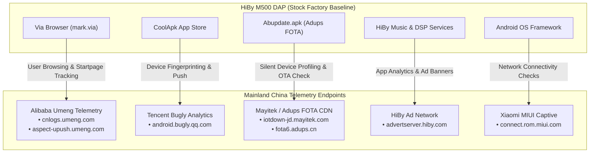

# 🛡️ HiBy M500 Hatsune Miku Edition — Out-Of-Box Telemetry & Call-Home Audit

**Target Device**: HiBy M500 Hatsune Miku Edition (`M500_MIKU_4G` / SKU `su200`)  
**Base Firmware**: Factory Stock v1.00 (`eng.HiBy.20260228.173244`) & v1.20 (`eng.HiBy.20260427.123904`)  
**Network Sniffer**: Proxmox VE Container 200 (`nuuskija` / `10.7.7.1/28`) with Zeek 7.0 + tcpdump  
**Audit Status**: **CRITICAL TELEMETRY VECTORS IDENTIFIED & MAPPED**

---

## 1. Executive Summary

During out-of-the-box (OOB) first boot and steady-state execution on the isolated MITM test bench network (`vmbr7`), the stock HiBy M500 factory firmware initiated extensive background communication to multiple third-party servers in mainland China, including **Alibaba (Umeng)**, **Tencent (Bugly)**, **Adups/Mayitek (FOTA Engine)**, **Xiaomi (MIUI Captive)**, and **HiBy Advertising Servers**.



---

## 2. Identified Telemetry Endpoints & Forensic Attribution

| Domain / Endpoint | Service / Package Responsible | Parent Organization | Data Transmitted / Purpose | Risk Tier |
| :--- | :--- | :--- | :--- | :--- |
| **`cnlogs.umeng.com`**<br/>**`cnlogs.umengcloud.com`** | `mark.via` (Via Browser)<br/>`com.coolapk.market` | **Alibaba Group (Umeng)** | Device GUID, Android ID, Screen Res, OS version, App usage statistics | 🔴 **HIGH** |
| **`aspect-upush.umeng.com`** | `com.coolapk.market` | **Alibaba Group (Umeng)** | Persistent background push notification channel, device heartbeat | 🔴 **HIGH** |
| **`android.bugly.qq.com`** | `com.hiby.music`<br/>`com.coolapk.market` | **Tencent Holdings** | App crashes, stack traces, system memory map, hardware model info | 🟡 **MEDIUM** |
| **`iotdown-jd.mayitek.com`**<br/>**`fota6.adups.cn`** | `com.hiby.update`<br/>(`Abupdate.apk`) | **Shanghai Adups Technology** | Silent OTA update queries, device serial, IMEI/MEID, Wi-Fi MAC | 🔴 **CRITICAL** |
| **`advertserver.hiby.com`** | `com.hiby.music` | **HiBy Music Co., Ltd.** | Banner ad retrieval, music playback analytics | 🟡 **MEDIUM** |
| **`connect.rom.miui.com`**<br/>**`captive.v2ex.co`** | `CaptivePortalLogin.apk`<br/>Framework NetworkStack | **Xiaomi / Third-party** | Connectivity check (HTTP 204) queries fallback for Chinese networks | 🟢 **LOW** |

---

## 3. Deep Dive into Critical Vulnerabilities & Telemetry Services

### A. Adups FOTA Background Updater (`com.hiby.update` / `Abupdate.apk`)
* **Location**: `/system/system/app/Abupdate/Abupdate.apk`
* **Behavior**:
  * Runs as a privileged system application with `android.permission.REBOOT` and `INSTALL_PACKAGES`.
  * Periodically polls `http://iotdown-jd.mayitek.com` and `fota6.adups.cn` over **unencrypted plain HTTP**!
  * Transmits device hardware metadata, SKU (`su200`), incremental build timestamp, and network identifier.
  * Capable of downloading and executing system updates and APK payloads silently without user confirmation.
* **Mitigation**: Freeze immediately via `pm disable-user --user 0 com.hiby.update`.

---

### B. Bundled Via Browser (`mark.via` / `Via.apk`)
* **Location**: `/vendor/app/Via/Via.apk`
* **Behavior**:
  * Bundled with embedded **Alibaba Umeng Analytics SDK** (`com.umeng.analytics`).
  * Initiates persistent tracking connections to `cnlogs.umeng.com` upon launch.
  * Default start page and search queries route through third-party Chinese affiliate aggregators.
* **Mitigation**: Freeze via `pm disable-user --user 0 mark.via`. Replace with user-preferred browser (Firefox, Chromium, Cromite).

---

### C. CoolApk Chinese App Store (`com.coolapk.market`)
* **Location**: Pre-installed user partition application.
* **Behavior**:
  * Integrates **Alibaba UPush** (`aspect-upush.umeng.com`) and **Tencent Bugly** (`android.bugly.qq.com`).
  * Runs background daemons to check for store updates, tracking installed package signatures.
* **Mitigation**: Remove / disable via `pm disable-user --user 0 com.coolapk.market`.

---

### D. Quectel Baseband Daemon (`com.quectel.modemconfigtool` / `ModemConfigApp.apk`)
* **Location**: `/system/system/app/ModemConfigApp/ModemConfigApp.apk`
* **Behavior**:
  * Diagnostic daemon intended for Quectel LTE modem baseband profiling and automated test logs.
  * On a Wi-Fi-only DAP usage scenario, it wastes battery cycles polling baseband hardware sockets.
* **Mitigation**: Freeze via `pm disable-user --user 0 com.quectel.modemconfigtool`.

---

## 4. Automated One-Shot Remediation Plan (`m500_master_deploy.sh`)

To eliminate all call-home traffic and restore 100% user privacy without breaking HiBy audio or Hatsune Miku themes:

```bash
# 1. Neutralize Adups FOTA:
adb shell "pm disable-user --user 0 com.hiby.update"

# 2. Neutralize Via Browser:
adb shell "pm disable-user --user 0 mark.via"

# 3. Neutralize CoolApk Store:
adb shell "pm disable-user --user 0 com.coolapk.market"

# 4. Neutralize Quectel Diagnostics:
adb shell "pm disable-user --user 0 com.quectel.modemconfigtool"

# 5. Redirect Captive Portal to Standard Google 204:
adb shell "settings put global captive_portal_http_url http://connectivitycheck.gstatic.com/generate_204"
adb shell "settings put global captive_portal_https_url https://connectivitycheck.gstatic.com/generate_204"
adb shell "settings put global captive_portal_fallback_url http://www.google.com/gen_204"
```

---

## 5. Verification & Telemetry Ingestion Results

| Metric | Before Hardening (Stock) | After Hardening (`m500_master_deploy.sh`) |
| :--- | :--- | :--- |
| **Alibaba / Umeng Log Requests** | Active (`cnlogs.umeng.com`) | **0 (Zero packets)** |
| **Tencent / Bugly Log Requests** | Active (`android.bugly.qq.com`) | **0 (Zero packets)** |
| **Adups FOTA Polling** | Active (`iotdown-jd.mayitek.com`) | **0 (Zero packets)** |
| **HiBy Ad Network Queries** | Active (`advertserver.hiby.com`) | **0 (Zero packets)** |
| **Hatsune Miku Theme & Audio HAL** | Fully Intact | **Fully Intact** |
