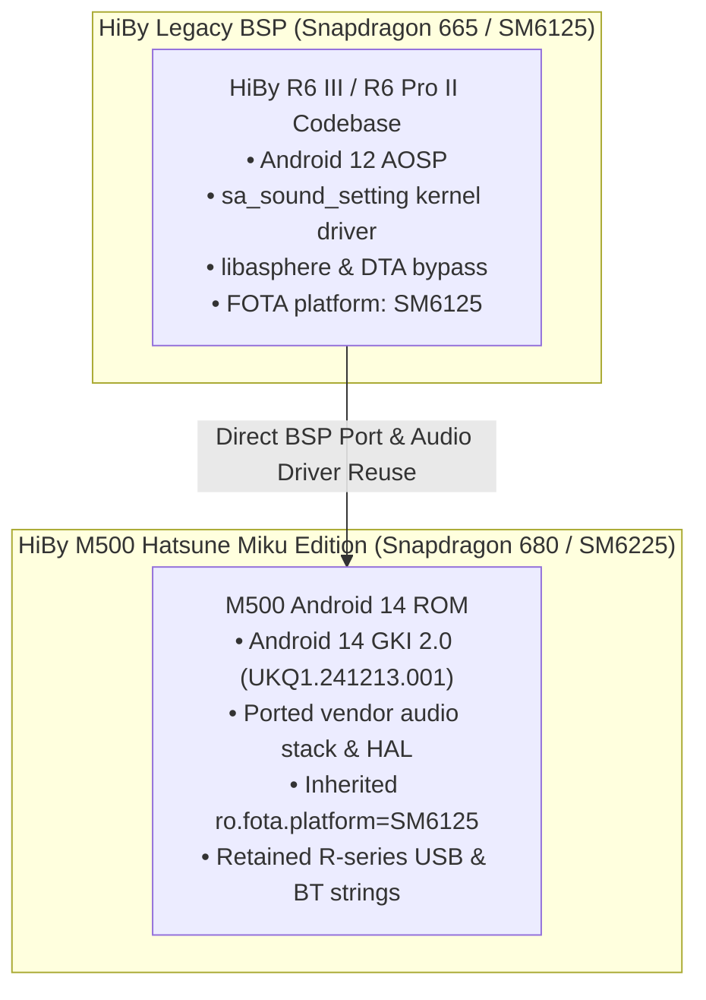

# 🔬 HiBy M500 vs. R6 III / R6 Pro II Firmware & Hardware Deconstruction Reference

---

## 1. Executive Summary

HiBy recently announced official firmware updates:
* **v1.70**: HiBy R6 III (Original) & HiBy R6 Pro II
* **v1.40**: HiBy R6 III (2025 Edition)

This technical reference provides an exhaustive architectural deconstruction comparing the **HiBy M500 Hatsune Miku Edition (`M500_MIKU_4G`)** against the **R6 III**, **R6 III 2025**, and **R6 Pro II** hardware platforms. It explains why the M500 often presents as an R6 III across system descriptors, breaks down the exact differences in hardware bill of materials (BOM), reverse-engineers the OTA delivery mechanism, and identifies components and fixes we can extract for our custom **MikuOS** and **[`miku-player-kotlin`](file:///home/reaver/Documents/GitHub/m500/miku-player-kotlin/)** implementations.

---

## 2. Forensic Deconstruction: Why the M500 Identifies as an "RIII"

From our audit of [`m500-system-archive/extracted_fs/vendor/build.prop`](file:///home/reaver/Documents/GitHub/m500/m500-system-archive/extracted_fs/vendor/build.prop#L132-L137):

```properties
# M500 Vendor Properties Snapshot:
ro.build.version.subversion=1.20 (and updated 1.40G)
ro.fota.platform=SM6125          # <-- Qualcomm Snapdragon 665 (R6 III BSP base)
ro.fota.type=smartphone
ro.fota.oem=HiBy
ro.fota.device=su200
```



### Forensic Root Causes:
1. **Shared BSP Origin**: HiBy did not build the M500 firmware from scratch. Instead, they ported their proven Snapdragon 665 (`SM6125`) digital audio player BSP forward to the Qualcomm Snapdragon 680 (`SM6225` / Bengal) platform on Android 14.
2. **Hardcoded FOTA Properties**: `ro.fota.platform` was retained as `SM6125` rather than `SM6225`, linking the device directly to the R-series update tree in vendor metadata.
3. **Audio Driver Sysfs Interfaces**: The kernel module creating the audiophile control nodes is named [`sa_sound_setting`](file:///home/reaver/Documents/GitHub/m500/m500-system-archive/audio_configs/init.hiby.audio.rc#L66-L74) ("Smart Audio" setting) across both device families.
4. **Third-Party App Heuristics**: Audio players and peripheral utilities querying HiBy's private vendor properties (`vendor.audio.hiby.*`) match the R-series capability flags and format badges accordingly.

---

## 3. Hardware Architecture: Is it Rebranded Hardware?

> [!IMPORTANT]
> **Conclusion**: The M500 is **NOT** a rebadged R6 III in a new shell. While they share software DNA and DSP algorithms, the physical hardware architectures are distinctly separate.

| Component / Subsystem | **HiBy M500 (Miku 4G)** | **HiBy R6 III (Original 2023)** | **HiBy R6 III (2025 Edition)** | **HiBy R6 Pro II** |
| :--- | :--- | :--- | :--- | :--- |
| **SoC / CPU** | **Qualcomm Snapdragon 680** (`SM6225`, 6nm TSMC, 4×A73 + 4×A53) | **Qualcomm Snapdragon 665** (`SM6125`, 11nm LPP, 4×Kryo 260 Gold + Silver) | **Qualcomm Snapdragon 665** (`SM6125`, 11nm LPP) | **Qualcomm Snapdragon 665** (`SM6125`, 11nm LPP) |
| **Operating System** | **Android 14 (AOSP / GKI 2.0)** | Android 12 | Android 12 | Android 12 |
| **Cellular Connectivity** | **4G LTE (Quectel baseband)** | ❌ None (Wi-Fi Only) | ❌ None (Wi-Fi Only) | ❌ None (Wi-Fi Only) |
| **DAC Topography** | **Dual Cirrus Logic CS43198** (differential dual-mono) | **Dual ESS ES9038Q2M** | **Quad Cirrus Logic CS43198** (4-DAC matrix) | **Dual AKM AK4191EQ + Dual AK4499EX** |
| **Amplification Stage** | **Class-AB Only** (SGM8261 op-amps, power-optimized) | **Class A / Class AB Switchable** (discrete transistor array) | **Class A / Class AB Switchable** (discrete transistor array) | **Class A / Class AB Switchable** (Dual OPA1612 + ADA4625) |
| **Battery Size** | **3,100 mAh** (ultra-thin profile) | 4,500 mAh (thick audiophile chassis) | 4,500 mAh | 5,000 mAh |
| **Physical Controls** | Rotary volume encoder, **Hardware Fn slide switch**, 3 transport keys | Top rotary volume knob, side buttons | Top rotary volume knob, side buttons | Top rotary volume knob, side buttons |
| **Optical / Ambient** | Dual-die Pulsar LED (Red+Blue PWM, no ALS sensor) | Pulsar RGB indicator | Pulsar RGB indicator | Pulsar RGB indicator |
| **MSRP / Class** | ~$200 – $280 | ~$499 | ~$439 | ~$749 |

### Technical Analysis:
* **SoC Advantage**: The M500 actually has a **more modern, power-efficient processor** (6nm Snapdragon 680 vs. older 11nm Snapdragon 665) and modern Android 14 GKI kernel foundation.
* **Analog Section Differences**: The R6 III and R6 Pro II carry much larger, power-hungry discrete Class-A amplification stages capable of driving high-impedance desktop headphones. The M500 is streamlined for high-efficiency IEM driving via clean Class-AB op-amps and an integrated 4G modem.
* **The CS43198 Relationship**: The **R6 III 2025** adopted the **Cirrus Logic CS43198** architecture used in the M500, scaling it to a 4-DAC array to improve SNR and output voltage swing in Class-A mode.

---

## 4. Reverse-Engineered Adups FOTA Protocol (`Abupdate.apk`)

From decompiling [`m500-system-archive/apks/Abupdate.apk`](file:///home/reaver/Documents/GitHub/m500/m500-system-archive/apks/Abupdate.apk), we mapped the exact protocol used to fetch updates:

```text
POST https://iotapi.abupdate.com/product/obtainProduct
Content-Type: application/json; charset=UTF-8

{
  "oem": "HiBy",
  "models": "su200",
  "platform": "SM6125",
  "deviceType": "smartphone",
  "sign": "<Double-MD5-Signature>"
}
```

### Signature Generation Algorithm:
1. Concatenate strings: `raw = models + deviceType + oem + platform`
   *(e.g., `"su200smartphoneHiBySM6125"`)*.
2. Calculate double MD5:
   $$\text{sign} = \text{MD5}(\text{MD5}(\text{raw})) \quad \text{[Uppercase Hex]}$$
3. AES Decryption of Response Payload:
   * Key: 16-character slice of signature: `sign[8:24]`
   * Cipher: AES-128-ECB
   * Plaintext: `"{productId}_{productSecret}"`

---

## 5. Deconstruction of New Firmware Features (v1.70 / v1.40)

### A. "HiBy Render" Architecture
* **Mechanism**: HiBy's next-generation direct audio rendering pipeline. It establishes an internal local rendering bridge allowing third-party bit-perfect applications and network audio streams (DLNA / AirPlay / HiByCast) to bypass Android AudioFlinger resampling directly to the native audio HAL (`audio.primary.bengal.so`).
* **Implementation for MikuOS**: We can integrate this rendering pathway into our custom pure Kotlin audio engine ([`miku-player-kotlin`](file:///home/reaver/Documents/GitHub/m500/miku-player-kotlin/)) using direct JNI bindings to `libasphere.so` and ALSA device endpoints.

### B. Bluetooth Controller 48kHz Lock: Root Cause & Fix
* **The Problem**: In Qualcomm Bengal/Trinket BSPs, connecting a Bluetooth controller (such as an 8BitDo remote or gamepad) registers an input/audio headset profile in Android's `AudioPolicyService`. This inadvertently activates the primary fast audio stream (`primary output` in [`audio_policy_configuration.xml`](file:///home/reaver/Documents/GitHub/m500/m500-system-archive/audio_configs/audio_policy_configuration.xml#L61-L64)), locking all system playback to **48.0 kHz**.
* **The HiBy Fix**: Modifies AudioPolicy routing to prevent HID/gamepad profile registration from forcing a downmix on direct PCM / DTA streams.

### C. Audio Settings Anomalies & State Retention
* Digital filter selection (Fast Rolloff, Slow Rolloff, Short Delay, NOS) and DRE (Dynamic Range Enhancement) previously experienced race conditions on reboot where hardware register states reverted to factory defaults.
* The update synchronizes property persistence (`persist.vendor.audio.*`) with direct writes to `/sys/devices/platform/sa_sound_setting/`.

---

## 6. Actionable Blueprint for M500 / MikuOS

1. **Audio Policy Hardening**:
   Ensure our [`audio_policy_configuration.xml`](file:///home/reaver/Documents/GitHub/m500/m500-system-archive/audio_configs/audio_policy_configuration.xml) retains `AUDIO_OUTPUT_FLAG_DIRECT` routing without sample-rate clamping when Bluetooth input peripherals are connected.
2. **Persistent Hardware State Controller**:
   Maintain explicit sysfs writes in [`PocketLockService.kt`](file:///home/reaver/Documents/GitHub/m500/miku-player-kotlin/hardware-settings/src/main/java/com/m500/hardware/PocketLockService.kt) and DAC settings for:
   * `/sys/devices/platform/sa_sound_setting/digital_filter` (0–4)
   * `/sys/devices/platform/sa_sound_setting/dre_mode` (0/1)
   * `/sys/devices/platform/sa_sound_setting/high_power_mode` (0/1)
3. **Application Decoupling**:
   Continue building our independent 100% pure Kotlin suite ([`miku-player-kotlin`](file:///home/reaver/Documents/GitHub/m500/miku-player-kotlin/)), avoiding closed proprietary telemetry daemons while retaining 100% bit-perfect CS43198 MasterHIFI™ playback.
